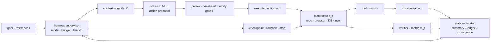

# LLM agent loop의 제어이론적 해석과 검증 경계

- 작성일: 2026-07-28
- 상태: analytical transfer note v0.3
- 목적: LLM과 harness가 보존하는 상태의 조합이 어떤 의미에서 폐루프 제어계를 구성하는지 밝히고, 단순한 비유와 검증 가능한 구조적 대응을 구분한다.
- 기본 범위: 추론 중 가중치가 고정된 tool-using LLM agent. Online fine-tuning, self-modifying harness, 물리 제어의 빠른 inner loop는 별도 경우로 구분한다.
- 주 근거 문서: [LLM agent loop: 선행연구 기반 증거 종합](agent-loop-prior-research-synthesis.md)
- 선행 문서:
  - [모델 대응과 수렴 조건](agent-loop-model-correspondence-and-convergence.md)
  - [Loop engineering을 위한 원인 식별 실험 설계](agent-loop-causal-diagnostic-protocol.md)
  - [POMDP·OGIS·CEGIS 이론 재정립 노트](M4b-agent-loop-theory-reframing-note.md)

> **증거 경계:** 이 문서는 agent-specific 실증 결과를 새로 확립하는 보고서가 아니라, 선행연구에서 관측된 구성요소와 실패 mode를 제어이론 언어로 옮기는 해석 노트다. 명시적으로 원문 근거를 붙이지 않은 수식, margin, signature test는 검증할 공학 가설이며, 실제 agent가 PID·MPC·adaptive control 등을 구현한다는 선행연구 결론이 아니다.

## 0. 결론

사용자의 가설은 **약한 구조 명제로는 성립 가능한 해석이지만, 선행연구가 강한 구현 명제를 직접 입증한 것은 아니다.**

가장 방어적인 분석 표현은 다음과 같다.

> 실행 observation이 다음 action에 인과적으로 반영되는 LLM agent는 **history-dependent stochastic closed-loop decision system**으로 기술할 수 있다. 선택한 system boundary에서 LLM, context compiler, controller memory, parser·selection·rollback·stop logic을 controller로 두고, tool executor와 verifier를 actuator–plant–sensor 경계에 두면 전체 loop를 동적 output-feedback 형태로 표현할 수 있다. 이는 구현 동일성이 아니라 분석을 위한 공학 모형이다.

이 결론을 세 수준으로 구분해야 한다.

| 수준 | 명제 | 판정 |
| --- | --- | --- |
| 구조적 명제 | 실행 결과가 다음 action에 인과적으로 반영되면 전체 시스템은 폐루프 동적 시스템이다. | 구현에서 직접 확인 가능 |
| 기능적 명제 | transcript·summary·constraint ledger·artifact snapshot의 조합이 다음 제어에 충분한 state estimate로 기능한다. | task별 반사실 실험 필요 |
| 강한 구현 명제 | 높은 성공률은 내부에 명시적 plant model, Kalman filter, PID 또는 MPC가 구현되어 있음을 뜻한다. | 성공률만으로는 도출 불가 |

여기서 특히 중요한 구분이 있다.

```text
closed-loop control
!= model-based control
!= model predictive control
!= controller parameter adaptation
```

PID도 명시적 plant simulator 없이 폐루프 제어를 할 수 있다. 반대로 LLM이 긴 계획을 출력한다고 해서 그 계획을 매 step 재최적화하는 MPC가 되는 것도 아니다.

따라서 “agent loop가 잘 작동한다”는 관찰로부터 바로 말할 수 있는 것은 다음 정도다.

1. 어떤 feedback channel이 open-loop 실행보다 유용한 정보를 제공했다.
2. LLM과 harness의 합성 policy가 그 정보를 action 변화로 바꿀 수 있었다.
3. 보존된 state가 적어도 해당 task distribution에서 필요한 일부 구분을 유지했다.
4. verifier, selection, rollback, stopping이 generator의 오류를 일정 부분 흡수했다.

반면 다음은 별도로 증명해야 한다.

1. 보존 state가 미래 제어에 대한 충분통계인가
2. loop가 안정적인가, 단지 finite budget 안에서 자주 성공했는가
3. controller가 실제 dynamics를 예측하는가, feedback에 반응만 하는가
4. visible metric의 안정화가 hidden task utility의 안정화를 뜻하는가

성능 향상 자체가 강한 controller 구조를 증명하지 않는 가장 단순한 반례도 있다. Fixed prompt에서 gold-valid candidate가 나올 확률이 `p`인 독립 proposal을 `K`번 만들고 verifier가 통과 후보를 선택하기만 해도

```text
P(success by K) = 1 - (1 - p)^K
```

가 된다. 이 loop에는 retry·verification·stopping의 시스템 이득이 있지만 generator의 feedback update나 explicit world model은 없어도 된다. 따라서 **반복 선택 이득**, **feedback correction 이득**, **model-based planning 이득**을 실험에서 분리해야 한다.

## 1. “제어이론의 모델”이라는 표현에는 네 의미가 있다

같은 `model`이라는 단어 때문에 서로 다른 주장이 섞일 수 있다.

| 의미 | 제어이론에서의 역할 | Agent system에서 묻는 질문 |
| --- | --- | --- |
| 분석용 system model | 전체 폐루프를 수식으로 표현 | agent trajectory를 state transition으로 모델링할 수 있는가 |
| controller | observation을 action으로 바꾸는 동적 law | LLM과 harness 중 어디까지 controller인가 |
| plant prediction model | action 이후 상태를 예측 | controller가 tool·environment dynamics를 실제로 예측하는가 |
| internal model | reference·disturbance의 구조를 controller 안에 재현 | 반복되는 error나 목표 구조가 어떤 state에 보존되는가 |

첫 번째 의미는 외부 연구자가 시스템을 모델링하는 방식이다. Agent 내부가 같은 수식을 명시적으로 계산할 필요는 없다.

두 번째 의미에서는 LLM과 harness의 합성이 controller다. LLM은 action proposal을 만들지만, 실제 action 가능 범위와 실행 순서, retry, rollback, stop은 harness가 바꾼다.

세 번째 의미가 있어야 엄밀한 model-based control 또는 MPC라고 부를 수 있다.

네 번째 의미의 고전적 internal model principle은 “controller가 plant 전체의 복제본을 가져야 한다”는 일반 명제가 아니다. 원래의 robust output-regulation 결과에서는 추종할 reference와 제거할 disturbance를 생성하는 dynamics가 핵심이다.

## 2. 가장 일반적인 상태공간 표현

### 2.1 Plant, observation, controller를 분리한다

외부 세계의 실제 상태를 `s_t`, 실행 action을 `u_t`, 외란을 `w_t`라고 하자.

```text
s_(t+1) = f(s_t, u_t, w_t)
y^perf_(t+1) = g(s_(t+1))
e^gold_(t+1) = E(r, y^perf_(t+1))
```

`s_t`에는 task에 따라 repository, build artifact, browser, database, user state, external service가 포함된다. 모델은 이를 직접 보지 않고 tool과 verifier가 만든 observation만 본다.

```text
o_(t+1) = h(s_(t+1), v_(t+1))
m_(t+1) = V(r, o_(t+1), visible_artifact_(t+1)) + eta_(t+1)
e^vis_(t+1) = E_vis(r, o_(t+1), m_(t+1))
```

- `r`: goal 또는 reference
- `y^perf_t`: 실제로 제어하려는 correctness·utility·safety output
- `e^gold_t`: reference와 실제 controlled output 사이의 task-defined discrepancy
- `o_t`: raw tool observation
- `m_t`: verifier가 만든 score, pass/fail, critique, counterexample
- `e^vis_t`: controller가 실제로 받는 typed residual 또는 constraint-error encoding
- `v_t`: sensor·tool noise
- `eta_t`: verifier bias·noise

`o_t`, `m_t`, `e^vis_t`는 plant state나 hidden gold error 자체가 아니라 controller-visible measurement다. 특히 `m_t`가 `y^perf_t`의 일부만 보거나 잘못된 construct를 측정할 수 있다는 차이가 proxy-metric 문제다. `e^gold_t`는 evaluator-only outcome으로 유지하며 oracle 실험이 아니면 controller input에 넣지 않는다.

### 2.2 Harness는 동적 controller의 내부 상태를 가진다

Harness state를 `q_t`라고 하자.

```text
q_t = (
  transcript,
  summary,
  constraint_ledger,
  artifact_identity,
  best_valid_checkpoint,
  branch,
  retry_count,
  mode,
  budget,
  pending_actions
)
```

Observer 또는 state-update 기능은 history와 새 observation을 `q_t`로 압축한다.

```text
q_t = O_psi(q_(t-1), u_(t-1), o_t, m_t, r)
c_t = C_psi(q_t, o_t, m_t, r)
```

- `O_psi`: state update, retrieval, summarization, deduplication, version reconciliation
- `C_psi`: 어떤 state를 선택해 어떤 순서와 schema로 prompt에 넣을지 정하는 context compiler

LLM은 context에서 실행 후보를 만든다.

```text
u_t_tilde ~ pi_theta(. | c_t, xi_t)
```

실제 action은 parser, permission, schema, safety rule, scheduler를 통과한 뒤 결정된다.

```text
u_t = Gamma_psi(u_t_tilde, q_t, o_t, permissions, safety_constraints)
```

따라서 외부에서 본 합성 controller는 다음과 같다.

```text
u_t
  ~ K_(theta,psi)(q_t, o_t, m_t, r, budget_t, xi_t)

q_(t+1)
  = O_psi(q_t, u_t, o_(t+1), m_(t+1), r)
```

즉 `q_t`는 step `t`의 새 measurement까지 반영한 controller state이고, 다음 state update는 action 실행 뒤 `o_(t+1),m_(t+1)`이 도착할 때 한 번 일어난다. 이것이 **dynamic output-feedback controller**의 형태다. LLM `pi_theta`는 controller 전체가 아니라 controller 안의 확률적 비선형 proposal module이다.

### 2.3 전체 폐루프 상태

Plant와 controller state를 합치면 다음 augmented state를 얻는다.

```text
z_t = (s_t, q_t, r_t, provider_state_t, tool_session_t)
z_(t+1) ~ F_(theta,psi)(z_t, w_t, v_t, eta_t, xi_t)
```

관련 hidden state까지 `z_t`에 포함하면 이 합성 과정은 Markov transition으로 표현할 수 있다. 실제 recorder가 일부를 누락하면 기록된 trace만으로는 Markov하지 않게 보인다.

이 문서의 기본 경계는 `LLM+harness = controller`, `external task environment = plant`다. Prompt optimizer를 연구할 때는 LLM API를 plant로 놓을 수도 있고, artifact 개선만 볼 때는 candidate를 plant state로 놓을 수도 있다. 따라서 component 대응은 분석 경계를 선언한 뒤에만 의미가 있다.



## 3. Agent 구성요소와 제어 구성요소의 대응

| 제어 구성요소 | Agent 구현 | 상태의 실제 위치 | 주의점 |
| --- | --- | --- | --- |
| reference `r_t` | task spec, acceptance criteria, system instruction | prompt·task record | metric과 동일하지 않다. |
| plant `f` | repository, browser, DB, service, user interaction | 외부 world state | LLM 호출 자체를 plant로 놓는 다른 분석도 가능하므로 경계를 선언해야 한다. |
| plant state `s_t` | 현재 파일·DB·UI·process·permission 상태 | environment | transcript는 이 상태의 완전한 복사본이 아니다. |
| controlled output `y^perf_t` | correctness, user utility, safety, persistent artifact | gold task definition | tool observation이나 visible score 하나와 같지 않다. |
| sensor `h` | read/search/API tool | tool runtime | tool이 관측하지 않는 hidden variable은 남는다. |
| measurement `o_t` | stdout, stack trace, DOM, API response | tool output | 오래되거나 다른 branch에서 나온 값일 수 있다. |
| performance·constraint error `m_t` | expected/actual diff, violated assertion·constraint | verifier·test output | 같은 output 좌표의 discrepancy operator가 있을 때만 엄밀한 reference error다. |
| observer frontend | observation parser, normalizer, provenance checker | deterministic harness | action parser와 역할이 다르다. |
| observer/state estimator | summarizer, memory updater, retrieval | harness 또는 별도 LLM call | summary가 충분통계라는 보장은 없다. |
| controller memory `q_t` | transcript, ledger, plan, best-so-far, retry·budget | harness store | 모델 weights나 KV cache와 다르다. |
| control law `K` | context compiler + LLM + selection·stop logic | model과 harness의 합성 | LLM만 떼어 controller 성능으로 귀속하면 안 된다. |
| actuator frontend | action parser, schema validator | harness | proposal을 typed command로 변환·거부한다. |
| actuator | patch application, browser action, API execution | executor | 제안된 text와 실제 실행 action은 다를 수 있다. |
| actuator constraint | permission, schema, rate limit, budget | runtime | saturation과 infeasibility를 만들 수 있다. |
| safety filter | precondition checker, policy gate, sandbox | deterministic harness가 바람직 | LLM judge 하나에만 맡기면 invariant 보장이 약하다. |
| disturbance `w_t` | concurrent edit, flaky service, user change, external drift | plant | LLM sampling noise는 plant disturbance가 아니라 controller randomness다. |
| controller noise `xi_t` | sampling, serving nondeterminism | model runtime | environment drift와 분리 측정한다. |
| terminal set `G` | hidden utility·safety·artifact persistence를 모두 만족 | gold evaluator | visible pass만으로 정의하면 proxy equilibrium이 된다. |
| supervisory mode | PLAN, ACT, VERIFY, RECOVER, ROLLBACK, STOP | harness FSM | mode 전환이 너무 빠르면 chattering이 생긴다. |

이 표의 대응은 대부분 **기능적 대응**이다. 예를 들어 summary를 observer라고 부르는 것은 summary writer가 Kalman filter 식을 계산한다는 뜻이 아니다. History를 control-relevant state estimate로 압축하는 위치를 가리킨다.

## 4. State의 조합은 무엇을 만들어 내는가

### 4.1 좋은 state는 world의 완전한 복사본이 아니다

제어에 필요한 state는 모든 사실을 보존할 필요가 없다. 다음 action과 미래 utility를 결정하는 데 필요한 구분만 보존하면 된다. [Subramanian et al.의 approximate information state](https://www.jmlr.org/papers/v23/20-1165.html)는 history의 함수가 expected reward와 다음 information state 또는 observation의 예측에 충분하고 재귀적으로 갱신되는 조건을 정식화한다. 자연어 harness state가 이 조건을 만족한다는 뜻은 아니다.

두 history `H_t`와 `H'_t`가 같은 harness state로 압축된다고 하자.

```text
Q(H_t) = Q(H'_t)
```

이 압축이 안전하려면 두 history에서 허용 action의 결과와 task-relevant future가 충분히 유사해야 한다. 서로 다른 action이 필요한 두 history를 같은 `q_t`로 합치면 state aliasing이 발생한다.

따라서 harness state의 목표는 다음에 가깝다. 관찰 조건부 분포만 비교하면 현재 policy가 만든 상관관계에 속을 수 있으므로, 허용 가능한 미래 intervention을 조건으로 둔다.

```text
compressed q_t
such that, for admissible a_(t:t+H),
P(task-relevant future | H_t, do(a_(t:t+H)))
approximately equals
P(task-relevant future | q_t, do(a_(t:t+H)))
```

이 식은 위 information-state 정리의 직접 결론이 아니라, closed-loop observational confounding을 피하기 위해 이 연구가 제안하는 **intervention-aware operational criterion**이다.

일반적으로 이런 압축은 유일하지도 trace만으로 식별 가능하지도 않다. 이는 POMDP의 belief state와 action-sufficient representation에 연결되지만, 자연어 summary가 자동으로 어느 조건도 만족하지는 않는다.

### 4.2 여러 state 층이 합쳐져 controller의 variety를 늘린다

LLM weights는 다양한 prior와 행동 pattern을 제공한다. Harness state는 현재 episode에서 어떤 world와 error mode에 있는지 구분한다. Tool은 이전에 관측할 수 없던 state를 드러낸다. Constraint와 permission은 허용 action을 줄인다.

```text
effective control capacity
  = parametric policy variety
  × observable state distinctions
  × executable action variety
  × verifier discrimination
  × retained history
```

이 식은 수치 항등식이 아니라 설계상 곱셈적 병목을 표현한다. 어느 한 항이 0에 가까우면 나머지가 커도 제어가 실패할 수 있다.

Ashby의 requisite-variety 관점으로 보면 harness memory와 tools는 controller가 구분하고 대응할 수 있는 disturbance class를 늘린다. 다만 “state가 많을수록 좋다”는 뜻은 아니다. 무관하거나 모순된 state는 observation noise와 잘못된 mode switching을 늘린다.

## 5. 하나의 agent에는 여러 시간척도의 loop가 중첩된다

| 시간척도 | loop | feedback source | 제어 대상 |
| --- | --- | --- | --- |
| token | autoregressive decoding | 직전 prefix token | 다음 token distribution |
| model call | reasoning·tool proposal | 현재 context | 한 번의 proposal |
| agent step | act → observe → update | tool·environment·verifier | external task state |
| supervisory | retry·branch·rollback·stop | progress, risk, budget | 실행 mode와 자원 |
| cross-episode | prompt·harness·policy tuning | 여러 trajectory의 outcome | controller parameter |
| training | gradient update | dataset·reward·loss | model weight |

외부 world를 제어하는 핵심 폐루프는 agent-step scale에 있다. Token autoregression은 자기 prefix를 조건으로 하지만, tool을 호출하기 전에는 새 environment measurement를 받지 않는다.

또한 cross-episode tuning이 없는 frozen agent에서는 `q_t`가 바뀌어도 controller parameter `theta, psi`는 바뀌지 않는다. 이는 동적 controller의 internal state update이지 엄밀한 adaptive-control parameter update가 아니다.

## 6. 어떤 제어계와 실제로 대응하는가

### 6.1 선택한 system boundary에서의 분석 모형: 확률적 비선형 동적 출력피드백

일반 tool agent에는 다음 특성이 함께 있다.

- 연속값과 text score뿐 아니라 discrete action·mode가 있다.
- parser rejection, retry, rollback, stop을 다루는 supervisory discrete-event·switching layer가 있다.
- LLM action은 확률적이고 비선형이다.
- environment는 부분 관측이며 tool action으로 observation을 능동적으로 얻는다.
- branch와 checkpoint 때문에 하나의 물리 시간축보다 search graph에 가깝다.

따라서 선형 PID나 LTI transfer function을 직접 가정하기보다 **partially observed stochastic nonlinear dynamic output-feedback form with a supervisory discrete-event/switching layer**를 선택한 system boundary에서의 분석 모형으로 사용할 수 있다. 이 표현은 agent 문헌의 architecture를 옮긴 engineering transfer다. Goebel–Sanfelice–Teel 의미의 hybrid system은 hybrid time domain과 flow·jump set/map을 명시한 경우에 사용한다. Purely discrete system도 degenerate hybrid formalism으로 넣을 수 있지만, step-based tool agent에 mode label이 있다는 사실만으로 엄밀한 hybrid model이 정의되지는 않는다.

Harness FSM은 일반적인 supervisor 또는 switching controller다. Ramadge–Wonham 의미의 formal supervisory control이라고 부르려면 plant event language, controllable·uncontrollable event, enable·disable semantics, legal specification과 nonblocking 조건을 명시해야 한다.

### 6.2 PID와의 대응은 제한적이다

| PID 요소 | Agent에서 가능한 기능적 유사물 | 엄밀한 동일성을 위한 조건 |
| --- | --- | --- |
| P | 현재 violated constraint에 즉시 반응 | 명시적 error와 고정된 response gain |
| I | 누적 error ledger, 반복 실패 count | error를 누적하고 action에 정해진 방식으로 반영 |
| D | score·failure trend에 따른 조기 감속·mode 변경 | error 변화율과 noise filtering을 명시적으로 사용 |
| anti-windup | permission·budget saturation 때 error 누적을 멈추거나 state를 reconcile | saturation signal과 reset/back-calculation rule |

자연어 critique를 prompt에 한 번 더 넣는다고 바로 proportional control이 되는 것은 아니다. Error magnitude와 action 변화 사이의 gain이 정의되어야 한다.

PID 비유가 유용한 곳은 실패 mode다.

- feedback을 과도하게 반복해 전체 artifact를 매번 다시 쓰는 현상: high-gain overshoot
- stale error를 계속 누적하는 현상: windup-like state accumulation
- noisy score 변화에 PLAN·ACT가 빠르게 전환되는 현상: feedback-noise sensitivity 또는 switching chattering

### 6.3 MPC 또는 receding-horizon control

MPC-like 구현을 주장하려면 최소한 다음이 필요하다.

1. 현재 measurement·state estimate 또는 이에 상응하는 prediction initialization
2. 대안 action 아래의 결과를 비교할 수 있는 action-conditioned finite-horizon prediction mechanism
3. horizon objective와 적용 가능한 constraint
4. action sequence의 optimization 또는 comparison
5. canonical receding-horizon 구현에서는 첫 move를 적용하고 새 정보로 반복

다음은 MPC가 아니다.

- 한 번 긴 plan을 만들고 끝까지 그대로 실행
- 미래 결과를 예측·비교하지 않고 매 step 새 문장을 생성
- feedback이 와도 기존 plan의 suffix만 기계적으로 소비

유한 horizon `H`의 action sequence를 예측·평가하고 첫 action을 적용한 뒤 새 정보로 반복할 때 receding-horizon이라고 부른다. 여기서 prediction mechanism은 명시적 state-space model뿐 아니라 검증된 input–output·data-based predictive relation일 수 있다. LLM이 매 tool result 뒤 재계획하더라도 explicit horizon, action-conditioned prediction, horizon objective 또는 sequence evaluation이 없으면 **closed-loop replanning heuristic**으로 분류한다.

MPC의 중요한 교훈은 “매번 다시 계획한다”만이 아니다. Terminal cost·terminal set·recursive feasibility 같은 조건이 없으면 receding horizon 자체가 안정성을 보장하지 않는다. Agent에서 horizon 끝의 safe terminal requirement와 remaining-budget feasibility를 명시했을 때 기능적 대응이 생긴다. Best-valid candidate 보존은 그 자체로 MPC terminal set이 아니라 별도의 monotone-retention 장치다.

### 6.4 Adaptive control

다음처럼 controller parameter나 dynamics estimate가 online data로 갱신될 때 엄밀한 adaptive-control 대응이 생긴다.

```text
phi_(t+1) = A(phi_t, prediction_error_t)
u_t = K(phi_t, q_t, o_t)
```

예:

- tool latency·failure rate estimate로 timeout과 retry policy를 갱신
- verifier calibration estimate로 selection weight를 조절
- 식별한 plant uncertainty·dynamics parameter가 planner/controller parameter를 바꾸는 online update
- 반복 task에서 dynamics model을 식별해 planning에 사용

반대로 이전 log를 prompt에 넣는 것만으로는 controller parameter adaptation이 아니다. 같은 `K`가 다른 internal state `q_t`에 반응하는 것으로 설명할 수 있다. Generic online fine-tuning도 online learning일 뿐 자동으로 adaptive control이 되는 것은 아니다. 식별한 plant uncertainty가 controller parameter를 바꾸고 폐루프 regulation 목적을 개선할 때에만 adaptive-control-like라고 분류한다.

### 6.5 Iterative Learning Control

ILC는 같은 horizon과 reference를 가진 작업을 여러 trial에서 반복하고, 이전 trial의 trajectory error로 다음 trial의 input trajectory를 갱신하는 구조다.

따라서 다음 조건일 때 agent와 잘 대응한다.

- 동일한 workflow·test suite·environment reset을 반복
- trial `k`의 step별 error를 trial `k+1` policy에 정렬해 반영
- task identity와 phase alignment가 유지

한 번뿐인 open-ended coding task 안의 retry는 보통 ILC가 아니다. Cross-episode memory가 서로 다른 task를 섞으면 이전 error가 오히려 disturbance가 된다.

### 6.6 POMDP history controller와 조건부 belief controller

Tool agent는 우선 history-dependent partially observed decision process다. Latent Markov state, action, transition·observation kernel과 reward가 명시될 때 POMDP model로 강화할 수 있다. 이 조건에서 full history로부터 갱신한 posterior belief는 이론상 decision state가 될 수 있다.

실제 harness의 summary·ledger는 우선 **finite-memory information-state candidate**다. 정규화된 posterior semantics와 observation-conditioned update가 검증되기 전에는 이를 belief 또는 belief approximation이라고 단정하지 않는다. 특히 다음이 자주 빠진다.

- 불확실성 또는 대안 hypothesis의 확률
- observation source와 freshness
- action이 observation을 어떻게 바꿨는지에 대한 transition
- 아직 관측하지 않은 변수

따라서 단일 확정 문장 summary보다 typed hypothesis set, provenance, confidence, unresolved query가 observer state로 더 적합할 수 있다. Latent state에 대한 정규화된 확률분포와 action–observation-conditioned filtering update가 검증될 때만 belief state라고 부른다. Reward와 future prediction에 대한 sufficiency만 확인되면 information-state controller라고 부른다.

고전적 LQG에서 가능한 observer–controller separation을 일반 agent에 가정해서는 안 된다. 같은 LLM이 summary와 action을 모두 만들면 estimator와 policy error가 상관될 수 있고, 잘못된 summary가 다음에 어떤 sensor를 호출할지까지 바꾼다. State representation은 독립적인 요약 정확도뿐 아니라 downstream control value로 검증해야 한다.

### 6.7 CEGIS, black-box optimization, tree search

모든 agent loop를 시간축의 regulation으로 설명할 필요는 없다.

- 반례로 candidate set을 제거하면 CEGIS
- scalar score만 따라 후보를 바꾸면 black-box optimization
- 여러 branch를 평가하고 되돌리면 tree search
- 환경 상태를 지속적으로 추종하면 feedback control

실제 agent는 이 구조들의 hybrid일 수 있다. 제어이론은 state·feedback·stability를 설명하고, CEGIS는 sound counterexample에 의한 candidate elimination을 더 정확히 설명한다.

## 7. 왜 loop가 많은 상황에서 효율적으로 작동하는가

### 7.1 조건이 맞는 feedback은 model mismatch의 영향을 줄인다

One-shot plan은 초기 context에서 추정한 world에 의존한다. 실제 environment transition이 예상과 다르면 남은 plan 전체가 틀릴 수 있다.

Closed loop는 numeric residual뿐 아니라 typed diff·counterexample·constraint violation의 형태로 예상과 실제의 차이를 얻을 수 있다.

```text
innovation_t
  = observed_effect_t - predicted_or_expected_effect_t
```

Observation이 informative하고 현재 artifact에 대응하며, corrective action이 실행 가능하고, effective feedback strength와 delay가 감당 가능한 범위라면 harness가 이 차이를 보존해 다음 action을 바꿀 수 있다. 이 조건 아래에서만 초기 model mismatch의 장시간 누적을 줄인다고 기대한다.

### 7.2 Harness state가 긴 history를 control-relevant state로 바꾼다

Full transcript는 정보가 많지만 중요한 사실의 위치가 불안정하고 모순이 누적된다. Typed state는 다음을 수행할 수 있다.

- 최신 artifact identity와 branch 고정
- 이미 위반한 constraint를 hard test로 승격
- best-valid checkpoint 보존
- pending hypothesis와 확인된 fact 분리
- budget과 permission을 action 선택 전에 노출

즉 harness는 단순 저장소가 아니라 observer, state estimator, constraint manager의 결합으로 기능할 수 있다.

### 7.3 Deterministic layer가 LLM의 확률적 proposal을 제한한다

LLM이 모든 candidate를 맞힐 필요는 없다. 다음 layer가 있으면 합성 시스템의 신뢰도가 올라갈 수 있다.

- schema-constrained action
- executable verifier
- independent selector
- transaction과 rollback
- idempotency와 replay
- valid-state absorption

이는 model accuracy가 곧 system reliability라는 가정을 끊는다.

### 7.4 Replanning은 긴 open-loop commitment를 줄인다

긴 action sequence를 한 번에 commit하지 않고 짧게 실행한 뒤 관측하면 model mismatch가 영향을 미치는 horizon을 줄인다. 그 대가로 token, latency, tool cost와 feedback noise에 더 많이 노출된다.

따라서 최적 loop frequency는 무조건 높지 않다.

```text
benefit of next observation
  > model-call cost
    + tool cost
    + side-effect risk
    + added feedback noise
```

### 7.5 효율 상승에는 서로 다른 세 mechanism이 있다

| Mechanism | 필요한 state | Observable signature |
| --- | --- | --- |
| independent restart + selection | candidate set, score, best-so-far | generator 분포는 바뀌지 않지만 `K`에 따라 coverage 증가 |
| corrective output feedback | observation, error, controller memory | real feedback이 sham feedback보다 다음 action과 recovery를 개선 |
| model-based lookahead | state estimate, dynamics prediction, horizon plan | future cost·terminal condition·prediction residual이 현재 action과 replanning을 바꿈 |

최종 success curve만 보면 이 셋을 구분할 수 없다. 이 구분은 explicit plant-prediction model 또는 model-based lookahead 주장에 대한 최소 식별 단계다. Francis–Wonham internal model principle은 §8.2의 별도 조건으로 판정한다.

## 8. “좋은 regulator에는 model이 있다”는 명제의 정확한 범위

### 8.1 Conant–Ashby good-regulator theorem

Conant와 Ashby는 outcome entropy를 최소화하는 regulator들 중 가장 단순한 regulator가 system event에서 regulator action으로 가는 mapping을 갖는다는 결과를 제시했다.

이 결과가 이 연구에 주는 통찰은 다음이다.

> 효율적인 controller는 world의 모든 세부사항이 아니라, 좋은 action을 구분하는 데 필요한 system equivalence class를 어떤 형태로든 반영해야 한다.

그러나 이 정리를 일반 agent 성공에 바로 적용할 수는 없다.

- 정리는 최적성과 단순성 조건을 사용한다.
- system-event distribution과 success criterion이 정의되어야 한다.
- 원문의 `model`은 명시적 forward simulator보다 넓은 mapping 관계다.
- 부분 관측, finite budget, nonstationarity, irreversible action이 자동으로 해결되지 않는다.

따라서 높은 benchmark 성공률은 “LLM 내부에 완전한 world model이 존재한다”는 증거가 아니다. 성공률은 **LLM과 harness 전체가 action-relevant partition을 구현한다는 해석과 양립**하지만, 그것만으로 internal representation의 존재·위치·충분성을 입증하지는 않는다.

### 8.2 Internal model principle

Francis–Wonham의 고전적 internal model principle은 선형·시간불변·유한차원 system의 robust output regulation에서 출발한다. Controller가 reference와 disturbance를 생성하는 dynamics를 feedback path 안에 적절히 포함해야 구조적 perturbation에도 regulation을 유지할 수 있다는 결과다.

Agent system에 옮길 때는 다음처럼 제한해서 해석해야 한다.

- reference·disturbance를 만드는 반복 dynamics를 명시적으로 가정한다.
- controller 안의 상태가 그 exosystem dynamics를 재현하는지 개입으로 확인한다.
- controller의 internal-model 구조를 유지한 채, 사전 정의한 admissible plant·exosystem perturbation 뒤에도 asymptotic regulation이 유지되는지 시험한다. Agent-level practical regulation은 원 정리의 결론이 아니라 별도 완화 기준으로 명시한다.

Constraint ledger, regression test, stopping rule은 유용한 memory·enforcement일 수 있지만 그 자체로 internal-model-principle의 증거는 아니다. 예를 들어 주기적 quota disturbance를 위상까지 추적해 상쇄하고 perturbation 뒤에도 그 regulation을 유지할 때에야 제한된 기능적 대응을 주장할 수 있다. 여기서 internal model은 full plant model과도 다르다. 또한 arbitrary nonlinear semantic task에 원 정리의 필요충분조건이 그대로 적용되지는 않는다.

따라서 이 항목들은 theorem-backed correspondence가 아니라, 먼저 검증해야 하는 design candidate다.

### 8.3 Model은 한 장소에 있을 필요가 없다

Agent의 control-relevant model은 분산되어 있을 수 있다.

| 위치 | 담을 수 있는 것 |
| --- | --- |
| LLM weight `theta` | 일반적인 code·web·tool prior, causal association, action pattern |
| prompt와 retrieved docs | 현재 task의 명세와 local dynamics |
| harness state `q_t` | 현재 episode의 error, constraint, branch, freshness |
| tool schema | 가능한 action 집합과 interface semantics |
| executor·environment | actuator와 plant mechanism; 예측에 사용되지 않으면 controller model이 아님 |
| verifier | goal에서 관측 가능한 error로 가는 measurement model |
| deterministic solver·test | 제한된 영역의 exact dynamics 또는 feasibility |

따라서 “model이 LLM 안에 있는가”보다 다음 질문이 더 유용하다.

```text
어떤 control-relevant relation이
어느 state layer에
어떤 fidelity와 lifetime으로
보존되고 실제 action에 사용되는가?
```

여기서 **plant prediction model**이라고 부를 수 있는 것은 counterfactual action의 결과를 예측하거나 action sequence를 비교·선택하는 데 실제 사용되는 representation이다. Conant–Ashby의 action-relevant mapping과 Francis–Wonham의 exosystem internal model은 이와 다른 의미의 model이므로 별도로 판정한다. 실제 transition을 일으키는 executor와 사후 성공을 판정하는 test는 각각 actuator·plant mechanism과 oracle·measurement일 수 있으며, 존재만으로 어떤 의미의 controller model도 입증하지 않는다.

## 9. 안정성과 수렴을 제어이론 언어로 다시 쓰기

### 9.1 Goal 도달, 경로 safety, 도달 뒤 retention을 분리한다

Agent task에서는 정확한 state 하나보다 유효한 goal set `G`와 절대 진입하면 안 되는 unsafe set `U`, 안전하게 작업을 포기하는 abort set `A`가 중요하다. 세 terminal set은 서로 겹치지 않게 정의한다.

```text
G = {
  z :
    hidden_utility(z) >= tau
    and terminal_safety_requirements(z)
    and required_artifacts_persist(z)
}

tau_G = inf {t : z_t in G}
tau_U = inf {t : z_t in U}
tau_A = inf {t : z_t in A}
```

Budget이 token·tool·latency처럼 여러 자원이라면 time index `t <= B` 대신 누적 cost vector를 사용한다.

```text
L_t = sum_(k < t) ell_resource(z_k, u_k)
b_t = B - L_t

J_B^pi(z_0)
  = P_pi(
      tau_G < min(tau_U, tau_A)
      and L_(tau_G) <= B componentwise
      | z_0
    )

Risk_B^pi(z_0)
  = P_pi(tau_U < min(tau_G, tau_A, tau_stop^B) | z_0)
```

여기서 `tau_stop^B`는 budget을 **초과한 뒤**가 아니라 runtime이 budget exhaustion으로 멈추거나 `U_adm(z_t,b_t)`가 비는 실제 stop event다. Action gate는 `ell_resource(z_t,u_t) <= b_t`를 만족하지 않는 action을 실행 전에 거부한다. Transition 뒤에는 unsafe, goal·safe-abort, 다음-action budget stop의 순서로 terminal outcome을 판정해 tie semantics를 고정한다.

`G`의 endpoint가 안전하다는 것만으로는 충분하지 않다. 중간에 `U`를 밟고 복구한 trajectory는 reach–avoid success가 아니다. 원하는 성질은 다음 세 개다.

1. **Reach:** 배치 policy가 budget 안에 `G`에 도달한다.
2. **Avoid:** 도달·종료 전 전체 경로가 `U`를 피한다.
3. **Stay:** 도달 뒤 stop하거나, 추가 step에도 `G`를 유지한다.

이는 equilibrium regulation보다 stochastic-shortest-path 또는 reach–avoid–stay 문제에 더 가깝다. Success, safe abort, budget exhaustion은 서로 다른 terminal outcome으로 기록한다.

### 9.2 Progress certificate는 hitting과 retention을 구분한다

Goal에 대한 nonnegative progress measure를 `W(z)`라고 하자.

```text
W(z) = 0  iff  z in G
```

`F_t`를 step `t` action 직전까지의 history sigma-field라고 하자. 다음은 항등식이 아니라 observer·metric·controller error와 다음 transition disturbance의 영향을 오른쪽 항으로 **상계할 수 있다는 검증 대상 contract**다.

```text
E[W(z_(t+1)) - W(z_t) | F_t]
  <= -alpha(W(z_t))
     + E[sigma(||d_t||) | F_t]
     + epsilon_observer
     + epsilon_metric
     + epsilon_controller
```

- `G` 밖의 모든 reachable history에서 stopped increment가 integrable하고 uniform conditional drift가 `-epsilon < 0` 이하면 `E[tau_G] <= W(z_0)/epsilon` 형태의 expected hitting-time bound를 얻을 수 있다.
- Bounded-jump 조건은 이런 기본 기대시간 bound 자체보다 concentration·tail bound를 추가할 때 필요하다.
- `G`의 absorption 또는 별도 retention 조건은 hitting 뒤 유지에 필요하며, hitting bound의 전제와 같지 않다.
- `W`가 visible proxy뿐이면 wrong equilibrium에 도달할 수 있다.

Persistent disturbance 아래 bounded error floor를 주장하려면 더 강한 ISS-like contract를 별도로 확인한다.

```text
E[W(z_(t+1)) | F_t]
  <= rho W(z_t) + E[gamma(||d_t||) | F_t] + c,
     0 <= rho < 1
```

`W(z_0)`가 integrable하고, nondecreasing class-K-like `gamma`에 대해 `||d_t|| <= d_bar`가 almost surely 균일하게 성립하면 이 contract 아래

```text
limsup_t E[W(z_t)]
  <= (gamma(d_bar) + c) / (1 - rho)
```

를 기대할 수 있다. 이는 임의 agent에 자동 적용되는 정리가 아니라 task·state region별로 검증할 명제다. 자연어 progress score 하나를 Lyapunov function이라고 선언해서는 안 되며, 일시적 detour가 필요한 search에는 uniform negative drift가 필요조건도 아니다.

### 9.3 Progress와 별도의 safety certificate가 필요하다

`W`가 감소해도 unsafe action을 한 번 거칠 수 있으므로 safety를 같은 scalar progress metric에 흡수하지 않는다. 예를 들어 `tau_stop=min(tau_G,tau_U,tau_A,tau_stop^B)`에서 멈춘 process에 대해 nonnegative `H_safe(z)`가 다음을 만족한다고 하자.

```text
H_safe(z) >= 1             for z in U
E[H_safe(z_(t+1)) | F_t] <= H_safe(z_t)
                            before tau_stop
```

Finite stopping horizon이거나 stopped supermartingale이 uniformly integrable이고 adaptedness 조건이 성립하면, 이 barrier는 unsafe-hit probability를 `E[H_safe(z_0)]`로 상계하는 방식의 certificate가 될 수 있다. 실제 agent에서는 정확한 certificate가 없더라도 deterministic shield, robust precondition, capability gate를 progress policy와 별도로 둔다.

Irreversible action은 rollback을 safety mechanism으로 삼을 수 없다. Two-phase commit, dry run, approval, canary, precondition으로 실행 전에 차단해야 한다.

### 9.4 배치 policy 성능과 attainable capacity를 분리한다

선형 system의 controllability rank test를 일반 semantic agent에 그대로 적용할 수 없다. 실무적으로는 reach–avoid probability를 두 수준으로 나누는 편이 맞다.

```text
R_B^pi(z)
  = J_B^pi(z)

R_B^*(z)
  = sup_(pi in Pi_adm) R_B^pi(z)
```

여기서 `Pi_adm`은 safety·permission·resource gate를 지키는 policy class다. `R_B^pi`는 현재 배치된 loop의 성능이고, `R_B^*`는 허용 action·interface와 policy class 안에서의 attainable capacity다. Oracle state와 gold feedback에서도 관측한 성능이 낮다는 것만으로 `R_B^*`가 낮다고 단정할 수는 없지만, 강한 oracle policy나 exact solver에서도 낮다면 task infeasibility, action grammar, permission, generator capacity를 우선 의심한다.

### 9.5 관측가능성보다 action sufficiency

World state 전체를 복원할 필요는 없다. 서로 다른 hidden state가 같은 observation을 만들더라도 동일한 action이 최적이면 제어에는 문제가 없을 수 있다.

문제는 다음 경우다.

```text
same recorded q_t
but
different required action or safety consequence
```

따라서 harness summary는 사실 회상률뿐 아니라 action choice와 gold outcome의 intervention gap, state-collision rate, relevant next-observation prediction을 함께 평가한다. Next-observation prediction은 유용한 필요 지표일 수 있지만 control sufficiency의 충분조건은 아니다.

여기서는 이 성질을 **action sufficiency** 또는 **goal-relevant information sufficiency**라고 부른다. 이는 unobservable mode의 안정성과 관련된 고전적 detectability를 뜻하지 않는다.

### 9.6 Recursive feasibility와 remaining-budget viability

현재 action이 좋아 보여도 남은 budget 안에 terminal requirement를 만족할 수 없게 만들 수 있다.

```text
b_(t+1) = b_t - ell_resource(z_t, u_t)
X_feas(b) = {
  z : goal 또는 safe-abort terminal까지
      admissible continuation이 존재
}
```

Nominal한 “continuation 하나가 존재한다”는 것은 remaining-budget viability heuristic일 뿐이다. Robust recursive feasibility를 주장하려면 선택한 action 뒤 모든 admissible successor가 `X_feas(b_t-ell_resource(z_t,u_t))`에 남아야 한다. Chance formulation이라면 예를 들어

```text
P(
  z_(t+1) in X_feas(b_t-ell_resource(z_t,u_t))
  | z_t, u_t
) >= 1-delta_t
```

는 one-step local chance-feasibility일 뿐이다. Episode 수준 bound가 필요하면 `sum_t delta_t <= delta_total`인 risk budget이나 그에 준하는 dynamic risk allocation을 정의한다. Agent에서는 exact set을 계산하기 어려우므로 remaining-cost lower bound, reserved verification budget, transactional checkpoint, safe-abort policy로 근사한다. Strict budget은 loop의 종료만 보장하며 success convergence를 보장하지 않는다.

## 10. 제어 관점에서 보이는 대표 실패 mode

| 현상 | 제어 해석 | Agent 원인 | 설계 대응 |
| --- | --- | --- | --- |
| 같은 두 수정 사이를 왕복 | limit cycle | delayed·contradictory feedback, branch 혼합 | state hash cycle detector, hysteresis, rollback |
| 작은 critique에 전체 artifact 재작성 | excessive gain·overshoot | feedback 중요도 calibration 부재 | local patch, trust-weighted feedback |
| 오래된 오류를 계속 고침 | delayed measurement | stale log, artifact version mismatch | provenance·freshness gate |
| constraint가 계속 누적되지만 실행 불가 | windup-like accumulation; integral state 식별 필요 | permission·budget saturation | conditional accumulation, reconcile/reset |
| PLAN·ACT·VERIFY가 빠르게 전환 | mode-switching chattering | noisy mode trigger | dwell time, debounce, confidence threshold |
| visible score는 안정되지만 실제 실패 | wrong equilibrium | proxy–gold mismatch | held-out gold audit, independent verifier |
| 좋은 상태 도달 뒤 다시 깨짐 | terminal set 비흡수 | unconditional extra iteration | best-valid checkpoint, stop/rollback |
| 새 task에서 과거 memory가 방해 | model mismatch·negative transfer | nonstationary plant, task identity loss | memory scope, change detection, reset |
| tool 실패를 reasoning 실패로 해석 | disturbance misclassification | sensor·actuator fault 미분리 | typed error taxonomy, retry policy |
| 동일 action이 다른 결과 | plant uncertainty | concurrency, hidden session, flaky service | snapshot, idempotency, nested repeat |

## 11. 가설을 반증 가능하게 만드는 식별 실험

Feedback 때문에 action과 과거 output·noise가 상관될 수 있어 naive open-loop regression이나 plant–controller 동시 귀속은 biased 또는 non-identifiable할 수 있다. 그러나 적절한 dynamics·noise model, excitation, controller knowledge 또는 indirect method 아래에서는 closed-loop data로도 consistent identification이 가능하다. Exact checkpoint와 randomized intervention은 이 프로젝트에서 귀속을 강화하는 설계안이지 유일한 식별법은 아니다.

### 11.1 Open-loop 대 closed-loop

동일 initial state와 budget에서 다음을 paired 비교한다.

| 조건 | 다음 step에 제공되는 것 |
| --- | --- |
| open-loop plan | 초기 observation만으로 전체 action sequence 생성 |
| blind receding | 매 step 재호출하지만 새 observation은 mask·length-match |
| feedback-only | raw observation 제공, persistent state 없음 |
| full closed-loop | observation + typed state + verifier + rollback |

```text
closed_loop_success_uplift@B
  = P(success by B | composite full loop)
    - P(success by B | paired open-loop)
```

이는 state·verifier·rollback을 함께 바꾼 **합성 architecture의 success uplift**이지 control gain이 아니다.

Blind receding condition이 필요한 이유는 “호출 수 증가”와 “새 feedback의 가치”를 분리하기 위해서다.

Feedback closure 자체는 typed state, verifier, rollback, call count, token budget을 고정한 다음 아래 `2×2`로 확인한다.

| Feedback | Randomized disturbance 없음 | 같은 randomized disturbance pulse |
| --- | --- | --- |
| length-matched sham | 반복·compute baseline | precommitted open-loop response |
| real observation | feedback만의 action effect | disturbance rejection과 recovery |

Real feedback가 다음 action을 바꾸는 **causal response**와, disturbance 뒤 gold state를 sham보다 더 잘 회복하는 **control value**가 함께 있어야 corrective closed loop라고 판정한다. 둘 중 하나만 보면 prompt sensitivity나 무효한 overreaction일 수 있다.

### 11.2 Observer와 state sufficiency

같은 checkpoint에서 다음 state 표현을 교체한다.

- full raw history
- production summary
- typed canonical state
- oracle state
- null 또는 stale state

측정값:

```text
observer_sufficiency_gap
  = predictive_loss(next relevant observation | q_t)
    - predictive_loss(next relevant observation | full history)
```

추가로 `q_t`만 같은 두 history에서 reference action이 달라지는 state-collision rate를 측정한다. Oracle state가 production summary를 구하고 stale state가 깨뜨리면 observer layer의 인과 역할이 확인된다.

Oracle은 production과 같은 schema의 **현재 task-state field만** 교체한다. Latent solution, gold label, future disturbance, optimal action을 포함하면 observer repair가 아니라 information leakage다. Estimation error, downstream action, gold outcome을 함께 측정하며, next-observation prediction만으로 control sufficiency를 판정하지 않는다.

Observer claim은 `production → oracle` repair, `production → null/stale` break, 길이가 같은 unrelated-field negative control을 모두 사용한다.

### 11.3 Causal feedback impulse response

Checkpoint에서 다른 입력은 고정하고 domain이 정의된 typed feedback component 하나만 주입한다. 예를 들어 numeric residual field `o_t[j]`에 사전 등록한 단위의 `delta`를 더하고, baseline과 treatment를 모두 반복 표집한다.

```text
D_(u<-o): observation perturbation -> immediate requested action
D_(q<-o): observation perturbation -> immediate observer-state update
P_(y<-u)(1): forced executed action -> one-step plant output
P_(y<-u)^open(k): forced action 뒤 future action을 고정한 plant rollout
T_(e_gold<-w)^closed(k): unrestricted forward replay의 closed-loop total effect
```

측정:

- 다음 action category 변화
- 위반 constraint 수정률
- `k` step 뒤 gold error
- overshoot와 regression
- 영향이 사라지는 horizon

`D`를 측정할 때는 plant state와 나머지 input을 고정한다. Multi-lag plant response는 future executed-action sequence를 고정하거나 안전한 break-loop를 사용한다. 반대로 개입 시점의 prefix·checkpoint만 같게 하고 이후 trajectory를 자유롭게 forward replay하면 downstream controller action까지 포함한 `T^closed`, 즉 total closed-loop effect다. 이를 plant 또는 controller kernel이라고 부르지 않는다.

이 response들을 분리해야 feedback 사용, observer update, actuator 이후 plant dynamics, disturbance rejection을 혼동하지 않는다. 이 값들은 randomized causal response다. Linearity와 time invariance를 먼저 검증하지 않은 상태에서 classical transfer function이라고 부르지는 않는다.

### 11.4 Feedback gain·delay·noise sweep

독립적으로 다음을 조작한다.

| 축 | 수준 예 |
| --- | --- |
| numeric feedback scale | `e_tilde^vis = k e^vis_(t-d) + n_t`, `k ∈ {0, 0.5, 1, 2, 4}` |
| typed action blend | `u(k)=u_ff+k(u_fb-u_ff)`; 동일 action space에서만 |
| natural-language strength | hint / critique / typed feedback; gain이 아닌 categorical condition |
| enforcement | soft / hard rejection; feedback scale과 별도 factor |
| delay | 0 / 1 / 3 step / final-only |
| corruption | 0 / 5 / 20% field noise |
| freshness | current / one-version stale / wrong branch |
| verifier confidence | calibrated value 제공 / 제거 / 잘못된 값 |

결과로 success뿐 아니라 settling step, cycle rate, overshoot, valid-state regression, tool cost를 그린다. Delay가 증가할 때 oscillation이 급격히 커지는 지점은 empirical delay margin이다. 자연어 hint에서 hard rejection으로 바꾸는 것은 정보량·schema·policy·actuator enforcement를 동시에 바꾸므로 connected gain interval의 축으로 쓰지 않는다.

Asynchronous result는 logical-step delay와 wall-clock delay를 분리하고 `job_id`, `parent_state_hash`, `source_version`, `branch`, `issued_at`을 보존한다. Current state와 맞지 않는 결과는 discard·replay·version gate 중 사전 정의한 처리를 적용한다. Bounded delay만으로 임의 agent의 안정성이 따라오지는 않으며 contraction·small-gain과 같은 별도 조건이 필요하다.

### 11.5 Saturation과 anti-windup

Windup을 시험하기 전에 controller-visible cumulative signed error `e^vis`를 보존해 action에 반영하는 **integral-like state**가 실제로 있는지 식별한다. Hidden `e^gold`는 outcome 평가에만 쓴다.

```text
e^vis pulse duration {1, 4}
× memory {normal, reset, leak, none}
```

History 생성 구간에서는 branch 간 `u_exec`와 plant state를 강제로 같게 유지한다. Pulse 길이에 따라 accumulator와 이후 requested action이 누적되고, reset·leak가 사전 예측 방향으로 이를 바꾸어야 integral-like claim을 지지한다.

그 다음 tool permission, action budget, rate limit을 의도적으로 포화시킨다.

```text
u_req,t  = controller가 요구한 typed action
u_exec,t = parser·permission·limit 이후 실제 적용된 action
actuation_gap_t
  = 1[not semantically_equivalent(u_req,t, u_exec,t)]
```

`actuation_gap`에는 `clipped`, `rate_limited`, `budget_limited`, `permission_denied`, `schema_rejected`, `safety_filtered`, `deferred` reason code를 붙인다. 이 중 command bound·rate·budget clipping만 strict saturation metric에 포함한다. Permission denial과 schema rejection까지 saturation으로 묶으면 anti-windup 해석이 깨진다.

비교:

- `saturation on/off`
- `no anti-windup / freeze / back-calculation`
- permission 회복 시 state reconcile 또는 reset

Windup signature는 식별된 accumulator가 actuator saturation 중 계속 증가하고, 포화 해제 뒤 과도한 반대 action이나 긴 회복을 만들며, freeze·back-calculation이 이를 줄이는 것이다. 이 선행 증거가 없으면 stale plan, retry queue, delayed observation이라는 대안 설명을 유지한다.

### 11.6 MPC signature test

현재 observation은 고정하고 다음만 바꾼다.

- planning horizon
- terminal requirement
- predicted future tool outcome
- future action cost
- constraint가 활성화되는 미래 step

첫 action이 reference finite-horizon solver의 첫 action과 사전 등록한 허용오차 안에서 일치하고, plan suffix 고정 실행보다 disturbance recovery가 좋으며, prediction residual 뒤 실제로 suffix를 폐기하고 재최적화하면 MPC-like evidence가 된다. Reference solver와 비교할 수 없으면 더 약한 `lookahead-sensitive heuristic`으로만 판정한다.

반대로 첫 action이 현재 critique에만 반응하거나 처음 만든 plan을 끝까지 실행하면 MPC 설명은 약해진다.

### 11.7 Model-mismatch와 replanning

Nominal prediction model이 명시된 task에서 actual plant를 통제해 mismatch를 조작한다.

```text
mismatch mu ∈ {0, 0.25, 0.5, 1}
× execution mode {
    initial-plan execution,
    observation-conditioned replanning
  }
```

매 action 전에 predicted next state·horizon cost를, observation 뒤에는 prediction residual·plan revision을 기록한다. `mu`의 의미와 nominal·actual plant fingerprint는 실험 manifest에 정의한다. 이런 조작 없이 `mu*`를 model-mismatch margin으로 보고하지 않는다.

### 11.8 Adaptive-control signature

동일한 current `q_t,o_t`를 주되 이전 episode의 system-identification data만 다르게 제공한다.

- controller parameter·timeout·retry gain이 실제로 갱신되는가
- parameter change가 held-out dynamics prediction을 개선하는가
- plant가 바뀌면 change detector와 reset이 작동하는가

Prompt 내용만 달라진 경우와 persisted parameter `phi_t`가 달라진 경우를 구분한다.

### 11.9 ILC signature

동일 task와 environment reset 아래 trial을 반복한다.

```text
u_(k+1,0:T)
  = u_(k,0:T) + L(e^vis_(k,0:T))
```

다음을 검사한다.

- 같은 phase의 error가 다음 trial의 같은 phase action을 바꾸는가
- evaluator-only `e^gold`의 trial norm이 감소하는가
- task identity를 바꾸면 update를 reset하는가

서로 다른 task에서도 같은 효과가 난다면 ILC보다 일반 memory·policy improvement 설명이 맞을 수 있다.

### 11.10 Switching-supervisor signature

Mode label이 아니라 guard와 mode별 action law를 개입한다. 이 보고서에서는 switching supervisor를 기본 용어로 쓰며, hybrid time domain과 flow·jump semantics를 명시한 실험에서만 hybrid formalism으로 강화한다.

- guard threshold 바로 아래와 위의 `g=c-epsilon`, `g=c+epsilon`
- 같은 state에서 `do(mode=PLAN|ACT|VERIFY|ROLLBACK)`
- production switching과 hysteresis·minimum dwell-time 적용 조건

Mode를 강제했을 때 enabled action set과 transition이 달라지고, guard perturbation이 switch를 재현하며, dwell-time이 boundary chattering을 줄여야 functional switching supervisor라는 근거가 된다. 각 mode가 단독으로 잘 작동해도 임의 switching이 안정적이라는 뜻은 아니다.

Dwell-time이 chattering을 줄였다는 관찰도 곧 stability theorem의 증거는 아니다. 예를 들어 공통 comparison domain에서 모든 within-mode step에 `V_i^+ <= lambda V_i`, `lambda < 1`, 모든 admissible switch에 `V_j <= mu V_i`, `mu >= 1`인 multiple-Lyapunov bound를 입증한다고 하자. Switching count가

```text
N_sigma(k_0,k)
  <= N_0 + (k-k_0)/tau_a
```

를 만족하고 additive disturbance가 없는 pathwise setting에서는 `tau_a > log(mu)/(-log(lambda))`가 단순한 sufficient condition이 된다. Stochastic setting에서는 같은 관계를 conditional expectation contract로 다시 정의해야 하며, additive disturbance가 있으면 exact convergence 대신 practical floor가 남을 수 있다.

### 11.11 Classical transfer·margin 용어의 사용 조건

Agent trace에 response curve가 있다는 이유만으로 transfer function이나 gain·phase margin을 보고하지 않는다. Local region에서 다음을 먼저 시험한다.

```text
homogeneity:       response(alpha * delta) approximately alpha * response(delta)
additivity:        response(delta_1 + delta_2)
                    approximately response(delta_1) + response(delta_2)
time-shift invariance:
                    같은 mode·state region의 동일 impulse가 같은 lag response
```

이 검사를 통과하지 못하면 결과는 mode·state·task family에 조건화한 **generalized causal impulse response**와 **finite-budget robustness region**으로만 보고한다.

세 검사는 필요조건에 가깝고 충분하지 않다. Classical identification으로 더 나아가려면 typed numeric input/output, local stationary mode, randomized persistently exciting input, model-order selection과 held-out prediction, closed-loop endogeneity를 처리하는 forced-action 또는 indirect identification이 필요하다. 특히 gain·phase margin에는 plant와 controller를 분리하거나 안전한 break-loop 실험으로 open-loop loop transfer `L(z)`를 식별해야 한다. Closed-loop response만으로는 sensitivity와 complementary sensitivity를 `L(z)`와 혼동할 수 있다. 선형성 오차 tolerance와 confidence interval도 사전 등록한다.

### 11.12 구조 주장 판정 규칙

각 claim은 다음 세 개를 모두 요구한다.

1. 예상 방향으로 outcome을 구하는 repair
2. 해당 component를 깨뜨렸을 때 예상 방향으로 악화되는 break
3. unrelated field에서는 변화가 없는 negative control

구조별 negative control도 둔다.

- feedback: opposite-sign impulse, instance-shuffled feedback
- delay: source-step이 표시된 old observation과 최신처럼 위장한 stale observation
- anti-windup: no-saturation condition
- MPC: freeze-plan, no-model, irrelevant future-cost condition
- switching: label-only mode change, source-mode action schema가 유효한 intervention
- observer: equal-length unrelated field

판정 label은 `supported in tested regime`, `refuted in tested regime`, `inconclusive`로 제한한다. Practical-effect threshold, equivalence band, repair·break confidence interval, safe-set의 `s_min`, `q_max`, `c_max`, `v_max`는 사전 등록한다. Replay 복원 실패, intervention leakage, insufficient excitation, 넓은 confidence interval이 있으면 구조를 판정하지 않는다.

## 12. 최소 측정 지표

| 지표 | 정의 또는 목적 |
| --- | --- |
| reach-avoid `success@B` | budget `B` 안에 `U`를 거치지 않고 gold-valid set 도달 |
| time-to-hit | unsafe hit·safe abort·budget stop을 competing event로 처리한 restricted mean과 cumulative-incidence/survival curve |
| valid-state regression | 유효 상태 도달 뒤 다시 무효가 된 비율 |
| settling step | error가 허용 범위에 들어가 유지되기 시작한 step |
| overshoot | 개선 뒤 발생한 최대 gold-error 재증가 |
| cycle rate | 동일 state·artifact·mode hash 재방문 |
| control effort | tool call, edit size, token, latency, side-effect cost |
| feedback influence | feedback 교체가 다음 action distribution에 미친 변화 |
| correction value | feedback 개입이 이후 gold utility에 미친 효과 |
| observer collision | 같은 `q_t`가 서로 다른 reference action을 요구하는 비율 |
| disturbance gain | 주입한 tool·state disturbance 대비 gold loss 변화 |
| unsafe-hit risk | episode 중 한 번이라도 `U`에 진입할 확률의 upper confidence bound |
| safe abort | goal 대신 사전 정의한 안전 종료에 도달한 비율 |

고전 margin을 식별할 수 없는 경우에는 사전 등록한 조건을 모두 만족하는 perturbation 집합을 empirical safe region으로 둔다.

```text
delta = (numeric_gain, delay, noise, model_mismatch, ...)

S_B = {
  delta :
    LCB_reach_avoid_success(delta) >= s_min,
    UCB_normalized_error_area(delta) <= q_max,
    UCB_cycle_rate(delta) <= c_max,
    UCB_P(unsafe_hit | delta) <= v_max
}
```

Unsafe episode가 표본에서 0건이어도 sample size에 따른 upper confidence bound를 보고한다. 다차원에서는 baseline `delta_0`를 포함하는 connected component를 먼저 보고한다.

Scalar margin에는 quantifier를 붙인다.

```text
nominal slice:
  다른 모든 축을 delta_0에 고정한 safe interval 전체

retuned envelope:
  각 delay·noise에서 허용된 다른 tuning이 하나라도 존재하는 영역

robust radius:
  사전 정의한 norm ball 안의 모든 nuisance perturbation이 S_B에 드는
  baseline 주변 최대 radius
```

Safe region이 비단조·비연결이면 단일 `d*`, `eta*`, `mu*` 대신 interval·component 전체를 보고한다. 수치형 gain 한 축의 connected interval, §11.7의 nominal–actual plant 조작에 따른 mismatch slice도 같은 원칙을 따른다. Perturbation grid를 탐색한 뒤 영역을 선택할 때는 simultaneous confidence band, multiple-comparison correction 또는 별도 held-out confirmation으로 region-level coverage를 보장한다. 이는 해당 model·harness·state region·budget 안의 공학적 margin이며 전역 또는 점근 안정성 증명이 아니다.

Token, tool call, latency, edit size는 단위가 다르므로 그대로 더하지 않는다. 우선 다음을 함께 보고한다.

```text
reach-avoid success@B
expected cost-to-hit-or-stop
terminal-outcome incidence = (goal, unsafe, safe abort, budget stop)
Pareto vector = (tokens, tool calls, latency, edit size)
```

하나의 scalar가 필요하면 각 비용을 기준값으로 정규화하고 사전 등록한 weight로 episode 누적 scalarized cost를 정의한다. Hard safety는 monetized risk cost로 분모에 섞지 않고 constraint로 둔다. Gold error를 step마다 계산할 수 없는 실제 task에서는 실험용 synthetic twin과 held-out terminal evaluator를 함께 사용한다.

## 13. 권장 harness 구조

### 13.1 LLM의 역할과 deterministic control의 역할을 분리한다

| LLM에 적합 | Deterministic harness에 적합 |
| --- | --- |
| hypothesis와 candidate 생성 | permission과 schema enforcement |
| ambiguous observation 해석 | artifact identity·version 관리 |
| plan 대안 생성 | budget, idempotency, transaction |
| 새 diagnostic query 제안 | hard invariant, rollback, stop |
| semantic trade-off 설명 | exact test와 regression constraint |

안전성과 persistence를 LLM proposal의 평균 정확도에만 의존시키지 않는다.

### 13.2 Observer state를 typed하게 만든다

최소 field:

```text
observer_state:
  task_reference:
  artifact_id:
  environment_snapshot:
  confirmed_facts:
  unresolved_hypotheses:
  active_constraints:
  violated_constraints:
  latest_observation:
    source:
    version:
    timestamp:
    confidence:
  pending_jobs:
    - job_id:
      parent_state_hash:
      source_version:
      branch:
      issued_at_logical_step:
      issued_at_wall_clock:
  best_valid_checkpoint:
  actuator_status:
    permissions:
    remaining_budget:
    rate_limit:
  controller_mode:
```

자연어 summary는 이 state를 설명하는 view로 두고, 유일한 source of truth로 삼지 않는다.

### 13.3 식별 가능한 replay log를 남긴다

이 절의 log는 선행 [원인 식별 실험 프로토콜](agent-loop-causal-diagnostic-protocol.md)의 `loop-causal-v1` **확장**이다. Base schema의 exact serialized model input, raw model output, parsed proposal, tool observation, state before·after, checkpoint before·after, controller·model·tool-schema·state-policy·verifier·gold-evaluator fingerprint와 field별 no-op replay pass criteria를 모두 상속한다. 아래 control-specific field만 추가한다.

```text
identity:
  pair_id, intervention_id, event_id, parent_event_id
replay:
  exact_checkpoint, environment_hash, serialized_model_request
  model_seed, tool_seed, observation_noise_seed
signals:
  exogenous_w, observation_v
  feedback_source_step, artifact_version
  u_requested, u_executed, actuation_gap_reason
models:
  nominal_plant_fingerprint, actual_plant_fingerprint
  planned_actions, predicted_states, predicted_costs
  prediction_residual
controller_state:
  accumulator_value, reset_or_leak_mode
  anti_windup_mode
supervisor:
  mode, guard_values, switch_reason, dwell_time
audit:
  no_op_replay_fidelity, continuation_count
```

### 13.4 안전한 set과 terminal set을 코드로 강제한다

- destructive action 전에 precondition 검사
- irreversible action에는 dry run·two-phase commit·approval
- branch-local snapshot과 transaction
- success 조건 통과 artifact를 immutable checkpoint로 보존
- verifier disagreement 때 commit 대신 escalation
- remaining verification budget 예약
- cycle·chattering·windup detector

### 13.5 느린 LLM controller와 빠른 safety loop를 분리한다

물리 system이나 빠른 service control에서는 LLM latency와 stochasticity를 직접 inner loop에 두지 않는다.

```text
slow loop:
  LLM -> goal, mode, constraint, setpoint proposal

fast loop:
  deterministic controller -> real-time action, invariant enforcement
```

LLM은 supervisory controller로 두고, hard real-time stability와 safety는 검증 가능한 lower layer가 담당하는 구조가 더 안전하다.

## 14. 연구 판정표

| 관찰 | 지지되는 해석 | 아직 지지되지 않는 해석 |
| --- | --- | --- |
| feedback mask 시 성능 하락 | environment feedback의 인과 가치 | explicit plant model 존재 |
| oracle state가 production summary를 구함 | observer/state bottleneck | Transformer 특정 head가 observer |
| 미래 cost 변경이 첫 action을 바꿈 | predictive planning 사용 가능성 | MPC 안정성 보장 |
| feedback delay에서 cycle 증가 | closed-loop delay sensitivity | LTI phase margin의 정확한 값 |
| 식별된 accumulator가 saturation 중 누적되고 해제 뒤 overshoot | windup-like failure | 정확한 PI controller 구현 |
| 반복 trial error가 phase-aligned하게 감소 | ILC-like update | 다른 task로의 일반 수렴 |
| deterministic safety gate 아래 모델별 성능은 달라도 invariant 유지 | 안정성 일부가 architecture에 귀속 | 전체 task optimality |

## 15. 다음 실증 단계

### Phase A: 완전 관측 synthetic plant

- finite DSL repair
- versioned key-value transaction
- finite browser-state machine
- delayed noisy verifier task

각 task에 exact state, transition, gold error, safe set, feasible action을 둔다.

### Phase B: controller component 식별

- LLM 고정, harness만 교체
- harness 고정, LLM만 교체
- observer, selector, safety gate, stop logic을 한 번에 하나씩 개입
- open-loop, blind receding, full closed-loop 비교

### Phase C: robustness surface

- feedback delay·noise·staleness
- action saturation·permission loss
- plant drift·tool nondeterminism
- context compression·state collision

### Phase D: 실제 coding·web agent

Synthetic task에서 root-cause recovery가 검증된 recorder와 intervention engine만 실제 task에 적용한다. Real task에서는 asymptotic stability를 주장하지 않고 특정 distribution과 budget에서 다음을 보고한다.

```text
reach-avoid success@B
cost-to-hit
regression-after-hit
cycle probability
unsafe-hit probability upper bound
robustness curve
```

## 16. 근거 문헌과 주장 범위

### 제어·관측·상태

- Kalman (1960), [A New Approach to Linear Filtering and Prediction Problems](https://doi.org/10.1115/1.3662552)
- Luenberger (1964), [Observing the State of a Linear System](https://doi.org/10.1109/TME.1964.4323124)
- Åström & Murray (2008), [Feedback Systems: An Introduction for Scientists and Engineers](https://authors.library.caltech.edu/records/yzs24-xsx88)
- Witsenhausen (1971), [Separation of Estimation and Control for Discrete Time Systems](https://doi.org/10.1137/0309013)
- Kaelbling, Littman & Cassandra (1998), [Planning and Acting in Partially Observable Stochastic Domains](https://doi.org/10.1016/S0004-3702(98)00023-X)
- Subramanian et al. (2022), [Approximate Information State for Approximate Planning and Reinforcement Learning in Partially Observed Systems](https://www.jmlr.org/papers/v23/20-1165.html)
- Huang et al. (2022), [Action-Sufficient State Representation Learning for Control with Structural Constraints](https://proceedings.mlr.press/v162/huang22f.html)
- Gustavsson, Ljung & Söderström (1977), [Identification of Processes in Closed Loop—Identifiability and Accuracy Aspects](https://doi.org/10.1016/0005-1098(77)90009-7)
- Forssell & Ljung (1999), [Closed-loop Identification Revisited](https://doi.org/10.1016/S0005-1098(99)00022-9)

### Model-based·adaptive·iterative·hybrid control

- Rawlings, Mayne & Diehl, [Model Predictive Control: Theory, Computation, and Design](https://sites.engineering.ucsb.edu/~jbraw/mpc/)
- Mayne, Rawlings, Rao & Scokaert (2000), [Constrained Model Predictive Control: Stability and Optimality](https://doi.org/10.1016/S0005-1098(99)00214-9)
- Åström & Wittenmark (1995), [Adaptive Control](https://lup.lub.lu.se/search/publication/69dd8cb6-cfee-4771-8517-2ca75d58cd35)
- Wittenmark & Åström (1984), [Practical Issues in the Implementation of Self-Tuning Control](https://doi.org/10.1016/0005-1098(84)90010-4)
- Arimoto, Kawamura & Miyazaki (1984), [Bettering Operation of Robots by Learning](https://doi.org/10.1002/rob.4620010203)
- Ramadge & Wonham (1987), [Supervisory Control of a Class of Discrete Event Processes](https://doi.org/10.1137/0325013)
- Goebel, Sanfelice & Teel (2012), [Hybrid Dynamical Systems: Modeling, Stability, and Robustness](https://doi.org/10.23943/princeton/9780691153896.001.0001)
- Hespanha & Morse (1999), [Stability of Switched Systems with Average Dwell-Time](https://doi.org/10.1109/CDC.1999.831330)

### Stability와 safety

- Sontag (1989), [Smooth Stabilization Implies Coprime Factorization](https://doi.org/10.1109/9.28018)
- Sontag & Wang (2000), [Notions of Input to Output Stability](https://doi.org/10.1016/S0167-6911(99)00070-5)
- Jiang, Teel & Praly (1994), [Small-Gain Theorem for ISS Systems and Applications](https://web.ece.ucsb.edu/~teel/ECE236/jiang-teel-praly-1994.pdf)
- Ames et al. (2017), [Control Barrier Function Based Quadratic Programs for Safety Critical Systems](https://arxiv.org/abs/1609.06408)
- Prajna, Jadbabaie & Pappas (2007), [A Framework for Worst-Case and Stochastic Safety Verification Using Barrier Certificates](https://doi.org/10.1109/TAC.2007.902736)
- Bertsekas & Tsitsiklis (1991), [An Analysis of Stochastic Shortest Path Problems](https://doi.org/10.1287/moor.16.3.580)

### Regulator와 internal model

- Ashby (1956), [An Introduction to Cybernetics](https://ashby.info/Ashby-Introduction-to-Cybernetics.pdf)
- Conant & Ashby (1970), [Every Good Regulator of a System Must Be a Model of That System](https://doi.org/10.1080/00207727008920220)
- Francis & Wonham (1976), [The Internal Model Principle of Control Theory](https://doi.org/10.1016/0005-1098(76)90006-6)

### LLM agent에서의 최신 연결

- Yao et al. (2023), [ReAct: Synergizing Reasoning and Acting in Language Models](https://arxiv.org/abs/2210.03629)
- Shinn et al. (2023), [Reflexion: Language Agents with Verbal Reinforcement Learning](https://arxiv.org/abs/2303.11366)
- Yi & Song (2026, preprint), [Learning to Control LLM Agent Harnesses with Offline Reinforcement Learning](https://arxiv.org/abs/2607.05458)
- Prinos et al. (2026, preprint), [Stable Agentic Control: Tool-Mediated LLM Architecture for Autonomous Cyber Defense](https://arxiv.org/abs/2605.03034)

2026년 두 연구는 harness를 독립적인 control layer로 다루거나 deterministic tool layer에 안정성 책임을 배치한다는 점에서 직접 관련된다. 다만 아직 preprint이므로 일반적인 agent architecture의 보편 증거가 아니라 최근의 설계·검증 사례로만 사용한다.

## 17. 최종 요약

Agent loop가 효율적인 이유를 “LLM이 스스로 생각을 고친다”라고만 설명하면 핵심 state가 사라진다.

더 정확한 단위는 다음이다.

```text
world state
-> tool measurement
-> harness observer state
-> context projection
-> LLM proposal
-> deterministic action gate
-> world transition
-> verifier
-> retention · rollback · stop
```

실행 observation이 다음 action에 인과적으로 반영된다면 이 합성 구조는 폐루프 의사결정계다. 이를 output-feedback 형태로 분석할 수 있지만, 그 사실만으로 PID, Kalman filter, MPC, adaptive control 중 하나가 내부에 구현되었다고 결론 내릴 수는 없다.

현재 선행연구와 양립하지만 아직 직접 입증되지 않은 중심 가설은 다음이다.

> 성공적인 agent harness는 full history를 그대로 기억해서가 아니라, task에 필요한 world distinction, error, constraint, actuator status, safe checkpoint를 **control-sufficient state**로 보존하고, LLM의 넓은 proposal 분포를 verifier와 deterministic controller가 제한하기 때문에 효율적이다.

이 가설은 open-loop 대비 closed-loop uplift, observer-state intervention, causal feedback response, delay·noise·saturation robustness, MPC·ILC·adaptation signature test로 반증 가능하게 만들 수 있다.
