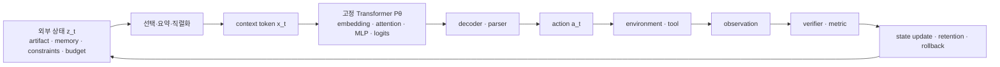

# LLM agent loop의 모델 대응과 수렴 조건

- 작성일: 2026-07-23
- 상태: research synthesis v0.1
- 목적: agent loop의 상태가 실제 모델 계산에 어떻게 들어가는지 분해하고, 작업·상태·metric·정책 중 무엇 때문에 loop가 수렴하거나 실패하는지 판별할 수 있는 기준을 만든다.
- 범위: 추론 중 가중치를 갱신하지 않는 decoder-only Transformer 기반 agent를 기본 사례로 삼는다. Test-time training이나 online fine-tuning은 별도 경우로 구분한다.
- 실증 근거: [LLM agent loop: 선행연구 기반 증거 종합](agent-loop-prior-research-synthesis.md)
- 제어이론 해석: [LLM agent loop의 제어이론적 해석과 검증 경계](agent-loop-control-theory-reformulation.md)
- 상세 실험 구현안: [Loop engineering을 위한 원인 식별 실험 설계](agent-loop-causal-diagnostic-protocol.md)

## 0. 결론

가장 중요한 결론은 **agent loop의 상태와 Transformer 구성요소 사이에는 일반적으로 일대일 대응이 없다는 것**이다.

실행 로그, 이전 출력, 계획, 반례, memory는 다음 호출 전에 문자열이나 multimodal token으로 직렬화된다. 모델 안에서는 embedding을 거쳐 각 층의 attention·MLP·residual activation에 분산되어 다음 token 분포를 바꾼다. 특정 로그 필드가 특정 attention head나 MLP 하나에 고정 저장된다고 말할 수는 없다.

반면 모델 밖에는 실제로 구별되는 상태가 있다.

- 가중치 `θ`: 학습 때 형성된 느린 parametric state
- prompt/context token `x_t`: 현재 호출에 명시적으로 주어진 입력 상태
- activation과 KV cache: 현재 forward/generation을 위한 일시적 계산 상태
- 파일, 브라우저, DB, tool process: 모델 밖 환경의 지속 상태
- transcript, constraint ledger, best-so-far, summary: harness가 유지하는 외부 recurrent state
- verifier score와 counterexample: 환경을 측정한 observation
- iteration, budget, branch, rollback: controller state

따라서 loop 전체는 “모델 내부에 loop가 하나 더 생긴 것”이 아니라, **고정된 모델을 전이 함수의 일부로 사용하는 외부 recurrent dynamical system**이다.

```text
external state z_t
  -> prompt/state compiler
  -> tokens x_t
  -> fixed Transformer P_theta
  -> decoded action a_t
  -> environment/tool transition
  -> observation + verifier result
  -> external state update z_(t+1)
```

수렴도 activation이 같은 값으로 가는 현상으로 정의하면 안 된다. 실무에서 필요한 수렴은 `실제 목표를 만족하는 상태 집합에 도달하고, 그 상태를 보존한 채 멈추는 것`이다. 이를 좌우하는 것은 모델 하나가 아니라 다음의 결합이다.

1. 정답 또는 유효 행동이 generator의 도달 가능한 범위에 있는가
2. observation이 실패 원인을 구분할 만큼 informative한가
3. 그 feedback이 다음 행동을 실제로, 올바른 방향으로 바꾸는가
4. verifier가 실제 효용과 정렬되어 있는가
5. 반례·제약·best-so-far가 손실 없이 보존되는가
6. 환경이 충분히 안정적이고 action을 되돌릴 수 있는가
7. 성공을 흡수 상태로 만들 stopping·rollback 규칙이 있는가

## 1. 주장 수준을 먼저 구분한다

이 문서는 다음 네 수준을 섞지 않는다.

| 표기 | 의미 | 예 |
| --- | --- | --- |
| `A` | architecture-direct | prompt token은 embedding과 Transformer block을 거쳐 logits에 영향을 준다. |
| `I` | implementation/system-direct | constraint ledger는 harness 파일이나 DB에 저장되고 다음 prompt에 삽입된다. |
| `E` | empirical | long context의 중간 정보 활용이 약해질 수 있다. |
| `F` | functional abstraction | summary는 belief-state approximation 또는 lossy state estimator로 모델링할 수 있다. |

`F`는 유용한 공학 모형이지만 내부 구현의 동일성을 뜻하지 않는다. 예를 들어 context를 추가한 Transformer가 제한된 회귀 문제에서 gradient descent와 같은 계산을 구현할 수 있다는 결과가 있어도, 일반 pretrained LLM이 모든 agent task에서 prompt를 optimizer state로 읽는다는 결론은 나오지 않는다.

### 1.1 용어부터 분리한다

사용자가 말한 “출력과 실행 로그를 다시 feed forward한다”는 표현은 **새 input으로 다시 forward pass한다**는 뜻으로는 맞다. 다음 네 개는 서로 다르다.

| 용어 | 실제 의미 |
| --- | --- |
| forward pass / inference | 고정된 parameter와 현재 input으로 activation과 output distribution을 계산 |
| FFN·MLP | Transformer layer 안에서 hidden representation을 변환하는 learned sublayer |
| feedback | tool·environment·evaluator의 결과를 다음 decision에 반영하는 system-level 경로 |
| backpropagation | loss gradient를 계산해 parameter를 갱신하는 training 경로 |

일반 inference loop에는 앞의 세 개가 있을 수 있지만 backpropagation은 없다. Feedback이 prompt token으로 들어가는 것과 feedback으로 model을 fine-tune하는 것은 다른 시스템이다.

## 2. 다섯 개의 시간척도

Agent state를 혼동하는 가장 흔한 이유는 서로 다른 시간척도의 상태를 모두 “memory”라고 부르기 때문이다.

| 시간척도 | 바뀌는 것 | 보통 유지되는 것 | 실제 위치 |
| --- | --- | --- | --- |
| 사전학습·fine-tuning | 가중치 `θ` | 학습 step 사이의 optimizer state | model checkpoint와 trainer |
| agent iteration | prompt, 외부 memory, artifact, environment | 보통 `θ` | harness, 파일, DB, tool |
| model call | hidden activation, attention 결과 | 입력 token과 `θ` | accelerator memory |
| token generation | prefix, KV cache, logits | `θ`, 이미 생성된 prefix | inference runtime |
| session 간 | 저장한 transcript·summary·skill, provider가 명시적으로 유지한 prefix/cache | 일반 activation은 소멸하고 cache 영속성은 protocol·TTL에 의존 | external store와 cache service |

핵심 구분은 다음과 같다.

```text
in-context change != weight update
KV cache reuse       != episodic memory write
textual reflection   != reinforcement-learning parameter update
metric improvement  != true task improvement
```

Reflexion은 이 차이를 명시적으로 이용한다. feedback을 받아 가중치를 갱신하는 대신 reflection text를 episodic memory buffer에 보존해 다음 trial을 조건화한다. 이는 빠른 외부 상태 갱신이지 parameter learning이 아니다.

## 3. 한 번의 agent step을 정확히 풀어 쓰기

외부 상태를 다음처럼 둔다.

```text
z_t = (
  goal,
  environment_t,
  artifacts_t,
  transcript_t,
  retrieved_memory_t,
  constraints_t,
  best_so_far_t,
  budget_t,
  controller_t
)
```

Harness는 이 중 일부를 선택·요약·정렬해 model input으로 만든다.

```text
x_t = Serialize(Select(z_t))
```

모델 호출 안에서는 다음 계산이 일어난다.

```text
h_i^0 = TokenEmbedding(x_(t,i))
h^l = TransformerBlock_l(h^(l-1); theta_l, position)
p_theta(y_t | x_t)
  = product_j p_theta(y_(t,j) | x_t, y_(t,<j))
```

`position`은 architecture에 따라 additive positional encoding일 수도 있고, RoPE처럼 attention의 query/key에 적용될 수도 있다.

Decoder와 parser가 token distribution을 시스템 action으로 바꾼다.

```text
y_t = Decode(p_theta; temperature, seed, constraints)
a_t = Parse(y_t)
```

환경과 verifier가 새 정보를 만든다.

```text
(environment_(t+1), raw_observation_(t+1)) = Env(environment_t, a_t)
v_(t+1) = Verify(goal, environment_(t+1), raw_observation_(t+1))
```

마지막으로 harness가 다음 외부 상태를 만든다.

```text
z_(t+1) = Update(z_t, y_t, a_t, raw_observation_(t+1), v_(t+1))
```

일반 frozen-weight loop에서 model parameter `θ`는 그대로다. Feedback이 조건부 분포를 바꾸는 주된 경로는 `x_(t+1) != x_t`인 것이다. 같은 input에서도 sampling seed, serving nondeterminism, decoder·runtime state 때문에 실제 output은 달라질 수 있다. Online fine-tuning은 `θ` 또는 adapter parameter를 갱신한다. 일부 [test-time-training architecture](https://arxiv.org/abs/2407.04620)는 base `θ`를 고정한 채 별도 fast state `φ_t`를 test sequence에서 갱신하므로 두 경우를 동일시하지 않는다.

## 4. Agent 구성요소와 모델 구성요소의 대응표

| Agent loop의 요소 | 실제 위치와 수명 | 모델 안에서 작동하는 경로 | 가장 정확한 기능 설명 | 동일시하면 안 되는 것 |
| --- | --- | --- | --- | --- |
| 목표·system instruction | prompt의 token, 호출마다 재주입 | embedding → 모든 Transformer layer → logits | policy를 조건화하는 입력 | 전용 goal register |
| 이전 모델 출력 | transcript 또는 artifact | 다시 넣은 token의 contextual representation | 자기 출력에 조건화된 새 inference | 가중치 학습 |
| 실행 로그·stack trace | tool output, 보통 text | tokenization 후 attention·MLP·residual stream에 분산 반영 | 환경 observation | 특정 head에 저장된 error state |
| test의 pass/fail | scalar를 text/field로 직렬화 | 조건 token으로 다음 분포에 영향 | 저대역폭 measurement | loss gradient |
| failing input·counterexample | structured observation 또는 regression test | prompt token + 외부 test artifact | 다음 후보를 제한할 수 있는 evidence | 자동으로 강제되는 hard constraint |
| 자연어 reflection | 생성 text와 외부 memory | 다음 prompt의 context | self-generated hypothesis 또는 critique | 독립적 evidence |
| transcript 전체 | context buffer | causal attention이 접근 | 명시적 단기 history | 완전하고 균일한 기억 |
| summary | 외부에서 만든 압축 token | 일반 context와 같은 경로 | lossy state estimate | 충분통계라는 보장 |
| retrieved memory | vector DB·파일 등에서 선택된 record | 검색된 조각만 prompt로 주입 | non-parametric memory access | model weight 안의 parametric memory |
| constraint ledger | 파일·DB·structured prompt | token으로 주입되거나 checker가 강제 | 외부 constraint store; 불일치 후보를 실제 제거할 때만 version-space state로 기능 | activation 또는 KV cache |
| best-so-far | artifact snapshot과 score | 필요할 때 prompt에 기술 | monotone retention과 rollback 기준 | 현재 model output |
| repository·browser·DB | 외부 환경 | read/search tool의 observation을 통해서만 보임 | persistent world state | context 안에 자동 복제된 상태 |
| iteration·budget·deadline | controller | prompt에 넣을 때만 모델이 볼 수 있음 | stopping과 resource state | Transformer layer depth |
| branch·checkpoint·rollback | harness·version control | 선택된 branch만 context로 노출 | search tree와 reversible state control | beam search와 항상 동일 |
| logits | model output head | `W_U h^L` | 다음 token에 대한 conditional score | task utility 또는 action value |
| temperature·top-p·seed | decoder/runtime | logits 이후 | exploration/action-selection policy | model weight |
| tool declaration·schema | API message와 prompt builder | input token/structured conditioning | 가능한 tool과 argument contract를 모델에 알림 | tool 실행 |
| constrained decoding | decoder/runtime | logits 이후 token·grammar 제한 | 허용 output space를 직접 줄임 | weight update |
| parser·executor | runtime/interface | model output의 후처리와 외부 실행 | token action을 typed action으로 컴파일·실행 | 언어모델 내부 계산 |
| verifier·LLM judge | 외부 program 또는 별도 model call | prompt feedback 또는 selection·stop·rollback에 직접 영향 | critic/oracle/measurement function | base generator의 loss function |
| online fine-tuning·LoRA | trainer 또는 adaptation layer | base·adapter parameter 변경 | 느린 parameter learning | 일반 agent iteration |
| test-time-training fast state | architecture-specific module | base `θ`와 별도인 `φ_t`를 test sequence에서 갱신할 수 있음 | 명시적 fast adaptation | 일반 KV cache나 prompt memory |

### 4.1 KV cache의 정확한 지위

KV cache는 이미 처리한 prefix token의 layer별 key/value를 다시 계산하지 않기 위한 inference state다. Prefix가 다음 token에 미치는 계산을 효율적으로 재사용하지만 다음 성질을 갖는다.

- 일반적으로 현재 request 또는 continuation의 token history에 종속된다.
- 논리적 constraint, 성공 판정, provenance 같은 typed semantics를 스스로 보장하지 않는다.
- cache를 버리고 같은 prefix를 다시 계산해도 원칙적으로 같은 조건부 계산을 재구성할 수 있다.
- Request 간 prefix/context cache를 명시적으로 보존하는 provider도 있으므로 수명은 cache protocol과 TTL에 의존한다. 보존되더라도 typed semantic episodic memory는 아니다.

Transformer-XL처럼 segment-level recurrence를 architecture에 넣은 모델은 예외적으로 이전 segment의 hidden representation을 다음 segment에서 재사용한다. 그래도 repository, test result, branch와 같은 agent state 전체가 그 recurrent memory와 동일해지는 것은 아니다.

### 4.2 Activation의 정확한 지위

Activation은 현재 입력을 처리하는 동안 계산된 일시적 표현이다. 실행 로그가 다음 action에 영향을 준다면 그 정보의 효과는 여러 token position과 layer의 activation에 나타날 수 있다. 그러나 다음 독립 호출까지 activation이 자동 유지되는 것은 아니다.

특정 로그 정보가 어느 layer·head·MLP 경로에 인과적으로 의존하는지 알고 싶다면 model-specific causal tracing, activation patching, ablation이 필요하다. 시스템 diagram만 보고 “이 로그는 attention, 저 constraint는 MLP”처럼 배정할 근거는 없다.

### 4.3 Weight의 정확한 지위

가중치는 pretraining과 post-training에서 획득한 parametric prior, skill, factual association을 담는다. 일반 inference loop는 이 값을 바꾸지 않는다. Prompt에 예시나 feedback을 넣어 행동이 바뀌는 in-context adaptation은 관찰 가능한 현상이지만 그 내부 알고리즘은 일반적으로 하나로 확정되지 않았다.

제한된 linear-regression 설정에서는 self-attention이 gradient-descent step과 같은 계산을 구현할 수 있다는 이론·실험 결과가 있다. 반면 실제 pretrained LLM의 ICL과 gradient descent가 서로 다른 순서 민감도와 output-distribution 변화를 보인다는 반론도 있다. 따라서 “prompt는 gradient이고 attention은 optimizer다”라는 일반 대응은 현재 근거보다 강하다.

### 4.4 Attention은 저장소가 아니라 현재 context를 읽고 혼합하는 계산이다

Self-attention은 현재 query와 이전 position의 key/value로 정보를 선택·혼합한다. Attention weight 자체도 input마다 새로 계산되는 activation이며 learned parameter와 다르다. Context는 attention이 읽을 수 있는 working set처럼 기능하지만 다음은 보장하지 않는다.

- field별 고정 주소
- 모든 중요 token의 안정적 회수
- 높은 attention과 인과적 사용의 일치
- 읽은 constraint의 논리적 강제

따라서 “agent memory가 attention에 저장된다”보다 “외부 memory에서 선택된 token을 attention 경로가 현재 계산에서 읽는다”가 정확하다.

### 4.5 MLP의 parametric memory 해석도 외부 memory와 구분한다

Geva et al.은 Transformer FFN을 textual pattern에 반응해 vocabulary distribution에 기여하는 key-value memory 관점으로 분석했다. 이는 학습된 MLP weight가 pattern-dependent computation과 knowledge를 담을 수 있다는 뜻이다. 실행 로그가 inference 중 MLP weight에 즉시 기록되거나, 각 log item이 MLP cell 하나에 대응한다는 뜻은 아니다.

## 5. Feedback이 다음 step을 바꾸는 세 경로

모델 출력과 실행 결과는 서로 다른 세 경로로 다음 step에 전달된다.

```text
1. textual channel:
   output/log -> serialization -> prompt token -> activation -> next logits

2. world-state channel:
   action -> file/DB/browser/process mutation -> later read/tool observation

3. controller channel:
   verifier result -> select/stop/rollback/branch -> retained state and next call
```

예를 들어 code agent가 patch를 적용한 뒤 test를 실행하면 다음 상태에는 `test log`뿐 아니라 `수정된 working tree`도 남는다. 다음 호출에 log만 넣고 현재 파일을 읽히지 않으면 모델은 실제 환경 상태를 완전히 알 수 없다. 반대로 파일만 읽히고 어떤 test가 왜 실패했는지 빠지면 error localization 정보가 사라진다.

이 세 경로를 섞으면 state bug, controller bug, model reasoning bug를 서로 오진한다.

- 실제 파일은 고쳐졌는데 summary가 이전 코드를 설명한다: stale external state
- test log는 최신인데 다른 branch의 파일을 읽는다: state identity mismatch
- 실패 입력은 transcript에 있으나 regression test로 강제하지 않는다: evidence retention은 있지만 constraint enforcement가 없음
- hidden tool session이 바뀌었는데 prompt에는 같은 state로 표현된다: state aliasing

## 6. 전체 loop는 합성된 state-space system이다

고정된 model, harness, verifier, environment를 합치면 다음 stochastic transition으로 볼 수 있다.

```text
z_(t+1) ~ F_(theta, Select, Decode, Env, Verify, Update)(z_t, xi_t)
```

여기서 `xi_t`는 sampling, tool noise, environment randomness를 포함한다. 이 표현의 장점은 수렴 실패를 모델 하나의 성질로 환원하지 않는 데 있다.



## 7. “수렴”을 여섯 가지로 나눈다

`loop가 수렴했다`는 말은 최소 여섯 의미를 가질 수 있다.

| 종류 | 관찰 기준 | 왜 부족할 수 있는가 |
| --- | --- | --- |
| 종료 | controller가 stop을 반환 | budget exhaustion도 종료다. |
| 행동 fixed point | 같은 답·action을 반복 | 틀린 답의 고착일 수 있다. |
| cycle | 유한한 상태들을 반복 | 수렴이 아니라 진전 없는 진동이다. |
| proxy convergence | visible score가 안정·상승 | Goodhart와 hidden failure가 가능하다. |
| constraint convergence | 현재 verifier가 새 반례를 못 찾음 | verifier coverage 밖의 오류가 남을 수 있다. |
| task convergence | hidden utility가 기준을 넘고 보존됨 | 정적·episodic task에서 원하는 수렴 정의다. |

정적·episodic task의 실무 정의는 다음과 같이 두는 것이 안전하다.

```text
G = {
  z : hidden_utility(z) >= tau
      and safety_invariants(z)
      and required_artifacts_persist(z)
}
```

정적·episodic task에서 loop success는 `G`에 도달하는 hitting event이고, completion은 controller가 그 유효 상태를 보존한 채 terminal state로 만드는 것이다. Continuing 또는 non-stationary task에는 absorption 대신 invariant violation risk, tracking error, dynamic regret가 더 적합하다.

```text
tau_G = min { t : z_t in G }
P(success by T) = P(tau_G <= T)
```

최신 score의 증가보다 `best hidden-valid state`, `time-to-hit`, `regression after hit`, `cost-to-hit`가 중요한 이유다.

유한 budget의 trace로 asymptotic convergence를 입증할 수는 없다. 실험으로 직접 추정할 수 있는 것은 특정 task distribution과 budget 아래의 `success@B`, `selected-success@B`, 정체·cycle·regression 확률이다. Nonzero-temperature sampling이나 지속적 exploration을 쓰는 경우 candidate가 한 점에 수렴하지 않는 것이 정상일 수도 있다.

## 8. 수렴의 조건

### 8.1 Reachability와 finite-budget coverage

Feedback이 완벽해도 generator와 action interface가 유효 해를 만들 수 없다면 loop는 수렴하지 않는다. 원인은 모델 capability, action grammar, 허용된 tool, permission, candidate representation일 수 있다.

Unconstrained softmax LM에서는 거의 모든 유한 문자열의 확률이 양수일 수 있으므로 raw mathematical support는 공학적으로 약한 조건이다. 필요한 것은 decoder, tool, policy, budget을 포함한 effective reachability다.

```text
R_B
  = P(exists t <= B: S(candidate_t)=1
      | model, decoder, tools, policy)
```

실험에서 직접 측정하는 것은 유한 budget `K`의 oracle-labeled `Pass@K`다. 유한 sample에서 성공 후보가 없으면 metric보다 generator prior mass, search policy, observability, action interface를 먼저 의심하되, 이것만으로 mathematical support가 0이라고 단정하지 않는다. Support 부재는 finite exhaustive enumeration이나 grammar-level impossibility가 있을 때만 확인할 수 있다. IID restart와 production adaptive policy의 `Pass@K` curve를 비교하면 generator coverage와 search collapse를 일부 분리할 수 있다.

### 8.2 Observability와 identifiability: feedback이 원인을 구분해야 한다

`fail` 한 bit는 현재 후보가 틀렸다는 사실만 줄 수 있다. Failing input, violated assertion, stack trace, expected/actual pair는 서로 다른 결함 가설을 제거한다.

서로 다른 hidden cause가 항상 같은 observation을 만들면 model은 history만으로 원인을 식별할 수 없다. 이때 더 오래 loop를 돌리는 대신 diagnostic action이나 observation schema를 바꿔야 한다.

### 8.3 Actionability: feedback이 다음 분포를 바꿔야 한다

Observation이 prompt에 존재하는 것과 사용되는 것은 다르다. 다음을 분리해 측정한다.

```text
feedback influence
  = distance(P(a_(t+1) | history, real_feedback),
             P(a_(t+1) | history, masked_or_shuffled_feedback))

correction value
  = E[hidden_utility_(t+1) | real_feedback]
    - E[hidden_utility_(t+1) | control_feedback]
```

Influence가 0에 가까우면 feedback이 무시된다. Influence는 큰데 correction value가 음수면 feedback을 사용하지만 잘못 해석하거나 update policy가 나쁘다.

### 8.4 Verifier validity: 측정값이 실제 목표를 따라야 한다

Visible metric `M`과 실제 utility `U`를 분리한다.

```text
candidate selected = argmax M(candidate)
actual goal        = argmax U(candidate)
selection regret   = max U(candidate) - U(argmax M(candidate))
```

Gao et al.의 synthetic reward-model 설정에서는 proxy를 더 강하게 최적화할수록 ground-truth가 악화되는 reward overoptimization이 관찰됐다. Production proxy가 후보 선택이나 수정 방향에 반복 사용되는 loop에서는 iteration이 optimization pressure를 높여 metric 결함을 증폭할 수 있다. 단순히 새 관찰이나 oracle evidence를 모으는 iteration까지 같은 효과를 갖는 것은 아니다.

### 8.5 Retention과 enforcement: 얻은 진전을 잃지 않아야 한다

Counterexample을 보았다는 사실만으로 candidate space가 줄지 않는다. 다음 후보가 그 counterexample을 통과하도록 test, typed constraint, solver clause 등으로 **강제**해야 한다.

유한 candidate set `C`에서 다음 조건이 성립하면 CEGIS식 종료 논리를 쓸 수 있다.

1. learner가 매번 아직 제거되지 않은 candidate를 선택한다.
2. verifier가 valid candidate에는 `ACCEPT`, invalid candidate에는 이를 제거하는 sound counterexample을 반환한다.
3. 모든 counterexample을 보존하고 다음 후보에 강제한다.

그러면 valid candidate가 있을 때 최대 `|C|`회 안에 찾고, 없을 때는 candidate set을 소진한다. 일반 LLM agent는 incomplete·noisy verifier, 무한 candidate space, 자연어 memory 손실, 반례 미강제 때문에 이 전제를 자주 위반한다.

### 8.6 안정성·가역성: world state가 추론 중 무너지지 않아야 한다

같은 action의 결과가 시간에 따라 크게 변하거나, action이 비가역 side effect를 만들거나, 여러 branch가 같은 environment를 오염시키면 과거 feedback의 의미가 달라진다. Snapshot, idempotency, sandbox, transactional action, branch-local environment가 필요한 이유다.

### 8.7 Absorption과 stopping: 맞은 상태를 다시 깨지 않아야 한다

성공한 뒤 무조건 한 번 더 수정하면 loop는 좋은 상태를 빠져나올 수 있다. 다음을 controller가 담당해야 한다.

- acceptance criteria가 모두 통과하면 candidate를 immutable best-so-far로 보존
- 새 후보가 전체 regression suite를 통과할 때만 승격
- expected value of another iteration이 비용·위험보다 작으면 종료
- 동일 state/action hash가 반복되면 cycle로 종료하거나 branch/reset

### 8.8 Non-stationarity와 stochasticity를 분리한다

같은 candidate의 결과가 흔들리는 현상은 두 원인이 다르다.

- `noise`: 고정된 snapshot과 같은 분포 안의 무작위 변동
- `drift`: repository, tool, model, requirement, verifier 등 분포 자체의 시간 변화

정확한 environment snapshot과 candidate를 고정한 nested repeat로 model/tool/verifier variance를 추정한다. 그 뒤 live time-ordered replay에서 평균이 움직이는지를 본다. Frozen replay에서는 안정적이고 live replay에서만 악화되면 “모델 확률성”보다 drift와 side effect를 먼저 의심한다.

목표 자체가 움직인다면 한 점 수렴 대신 dynamic regret, switching cost, tracking error가 맞는 outcome이다.

## 9. 작업 성격, metric 결함, state 결함을 구분하는 판별 실험

### 9.1 가장 먼저 실행할 reference intervention

| Intervention | 고정하는 것 | 바꾸는 것 | 결과 해석 |
| --- | --- | --- | --- |
| reference solution + gold evaluator | task specification, environment, action interface | candidate/action과 evaluator를 검증된 reference로 교체 | 이것도 실패하면 specification·environment·gold evaluator의 불일치 또는 infeasibility |
| oracle metric | 고정 candidate pool과 selector rule | production score/label만 gold score/label로 교체 | 회복되면 metric validity 문제 |
| reference selector | 고정 candidate pool과 모든 metric score | candidate 선택 규칙만 교체 | 회복되면 selection policy 문제 |
| oracle state field | model·task·metric·policy와 다른 state field | 의심 field 하나만 canonical value로 교체 | 회복되면 state 저장·검색·직렬화 문제 |
| oracle feedback | model·state·task·policy | vague/noisy feedback만 정확한 counterexample로 교체 | 회복되면 observability·localization 문제 |

이 개입은 “task가 어려워서”라는 설명을 더 좁은 원인으로 분해한다. Reference 값이 production component와 같은 interface를 따르는지, hidden target이나 gold label이 model context로 누출되지 않는지도 먼저 확인해야 한다.

### 9.2 Paired replay factorial

동일 task, 초기 state, candidate seed를 묶어 다음 요인을 하나씩 바꾼다.

```text
Observation O:
  real / masked / shuffled / counterfactual / exact counterexample

State codec S:
  full raw history / structured minimal state / natural-language summary / none

Verifier V:
  oracle / production proxy / noisy / delayed / same-model judge

Policy P:
  deterministic retry / diverse sampling / branch+rollback / constraint-guided

Environment E:
  frozen replay / live mutable / snapshot-isolated
```

전체 factorial이 비싸면 `O`, `S`, `V`, `P`를 paired ablation으로 시작하고 interaction이 큰 조합만 확장한다.

### 9.3 원인별 signature

| 관찰된 현상 | 우선 의심할 원인 | 구분 실험 |
| --- | --- | --- |
| visible score는 오르지만 hidden success는 하락 | metric misalignment·Goodhart | 같은 candidate trace를 oracle metric으로 다시 순위화 |
| 정확한 counterexample을 넣어도 같은 위반 반복 | constraint 미강제 또는 feedback 미사용 | regression test로 hard enforcement; feedback mask 대비 action 변화 |
| raw history는 성공하고 summary만 실패 | compaction distortion | 필요한 fact별 retention probe와 oracle-state condition |
| log 위치만 바꿔도 결과가 크게 변함 | context utilization·position bias | 동일 token을 앞/중간/끝에 배치 |
| 정답에 도달했다가 다음 iteration에 잃음 | best-so-far·stopping·rollback 결함 | passing snapshot 고정과 promotion gate 추가 |
| real feedback과 shuffled feedback의 성능이 같음 | feedback이 무정보이거나 policy가 무시 | oracle feedback을 넣고 action distribution 변화 측정 |
| oracle label로도 유한 후보 풀에 정답이 없음 | finite-budget generator/search coverage | IID restart와 adaptive search의 Pass@K, action space·model·tool 비교 |
| oracle state와 oracle verifier에서도 실패 | capability 또는 task/action interface | oracle solver와 reference action 실행 |
| seed를 바꿔도 같은 실패만 반복 | exploration collapse·강한 상관 | branch diversity와 candidate-distance 측정 |
| frozen replay는 성공하고 live run은 불안정 | environment non-stationarity·side effect | snapshot isolation과 idempotent replay |
| 같은 model이 생성과 채점을 함께할 때만 과대평가 | correlated verifier bias | 독립 program·model·human audit와 disagreement 측정 |

### 9.4 반드시 분리할 다섯 개의 causal test

| 검사 | 고정하는 것 | 바꾸는 것 | 분리하는 경계 |
| --- | --- | --- | --- |
| frozen candidate reselection | task, candidate set, gold label, selector rule | production metric ↔ oracle metric | metric과 proposal coverage |
| selector swap | candidate와 모든 metric score | production selector ↔ reference selector | metric과 selection policy |
| checkpoint state-field replay | environment, 다른 state field, metric, policy | state field 하나만 production ↔ oracle | state와 policy |
| exact-context policy swap | exact serialized input, metric, tool, budget | production policy ↔ reference policy | policy 자체 |
| all-reference task twin | oracle metric·state·policy, latent solution | task property 하나 | task effect와 `task × component` interaction |

Task가 어렵다는 이유만으로 `task defect`라고 부르면 안 된다. Reference solver, complete observation, oracle metric에서도 feasible solution에 도달할 수 없는지 확인해야 한다. Stress task에서만 state나 metric 결함이 나타나면 결론은 `task × state` 또는 `task × metric` interaction이다.

### 9.5 Generation과 verification gap

고정 후보 풀 `Y={y_1,...,y_K}`에 독립 gold label을 붙인다.

```text
S(y)
  = 1[U(y) >= tau and invariants(y)]

Pass@K
  = E[1[exists i: S(y_i)=1]]

SelectedSuccess@K(V)
  = E[S(argmax_i V(y_i))]

GenerationVerificationGap
  = Pass@K - SelectedSuccess@K(V)
```

- `Pass@K` 자체가 낮다: task fit, finite-budget generator coverage, observability, search budget 쪽
- `Pass@K`는 높은데 gap이 크다: verifier 또는 selector 쪽
- 고정 pool에서는 gap이 작고 online loop에서만 실패한다: metric이 다음 proposal을 잘못 유도하는 search-guidance 문제

Offline reselection과 online adaptive experiment를 모두 해야 selection 결함과 guidance 결함을 구분할 수 있다.

### 9.6 Repair와 break를 함께 측정한다

Production system을 `T1,M1,S1,P1`, reference component를 `X0`라고 하자.

```text
Repair_X =
  E[U(production에서 X만 reference로 교체)]
  - E[U(all production)]

Break_X =
  E[U(all reference)]
  - E[U(reference에서 X만 production으로 교체)]
```

Repair만 크면 다른 component가 결함을 보상했거나 실패 run을 선택한 편향일 수 있다. Repair와 break가 모두 재현되고 unrelated negative control에는 효과가 없으면 해당 reference replacement의 조건부 인과 효과가 강하게 지지된다. 그래도 component interface compatibility, hidden-target leakage, 다른 component와의 interaction을 확인하지 않고 “intrinsic bottleneck”으로 일반화하지 않는다. 최근의 Causal Agent Replay도 step에 `do` intervention을 가하고 같은 stochastic policy로 이후 trajectory를 다시 실행해 outcome distribution 차이를 측정하는 접근을 제안한다. 다만 2026년 6월 공개된 preprint이므로 아직 독립 검증이 필요한 frontier evidence다.

## 10. Metric 결함을 더 정확히 분해하기

Metric은 값뿐 아니라 **배선**을 명시해야 한다.

| Metric 사용 경로 | 실제 효과 |
| --- | --- |
| score·critique를 다음 prompt에 삽입 | model이 의미를 해석할 때만 다음 conditional distribution이 바뀜 |
| harness가 후보를 선택 | model 밖에서 search result가 직접 바뀜 |
| grammar·rejection·verifier-guided decoding | inference 중 허용 token/candidate가 직접 제한됨 |
| loss·reward와 optimizer step | model parameter가 실제로 갱신됨 |

좋은 score를 prompt에 넣어도 repair direction이 없거나 model이 사용하지 않으면 무효다. 반대로 score는 정확한데 selector가 무시하면 policy 결함이다.

| 결함 | loop에서의 효과 | 필요한 측정 |
| --- | --- | --- |
| false-positive rate | 실제 실패 후보를 잘못 승인 | `P(M=pass | U=fail)` |
| accepted-candidate failure risk | 승인된 후보 중 실제 실패가 많아 조기 종료 | `P(U=fail | M=pass)` |
| false-negative rate | 실제 성공 후보를 잘못 거절 | `P(M=fail | U=pass)` |
| rejected-candidate success risk | 거절한 후보에 성공이 많아 불필요한 수정 | `P(U=pass | M=fail)` |
| 낮은 coverage | visible test overfitting | visible-hidden gap |
| 낮은 resolution·plateau | 어느 수정이 나은지 구분 못함 | tie rate, conditional success by score bucket |
| 높은 variance | random walk와 불필요한 branch 전환 | repeated-score variance |
| delayed credit | 잘못된 action에 책임 배정 | feedback latency별 correction rate |
| non-stationarity | 움직이는 목표를 추격 | 같은 candidate의 시간별 score drift |
| manipulable proxy | iteration이 늘수록 Goodhart 악화 | score와 hidden utility의 optimization-depth curve |
| shared generator bias | generator와 judge가 같은 오류를 놓침 | independent-verifier disagreement |
| multi-objective collapse | 품질은 오르나 비용·안전 악화 | utility vector와 Pareto frontier |

Metric을 고칠 때 단순히 rubric을 길게 만드는 것으로 충분하지 않다. Coverage, calibration, independence, counterexample specificity, held-out audit를 각각 측정해야 한다.

## 11. State 결함을 더 정확히 분해하기

Agent state는 “많을수록 좋다”가 아니다. 필요한 정보가 보존되고 불필요한 정보가 행동을 방해하지 않는 최소 충분 표현이 목표다.

| 결함 | 구체적 사례 | 측정 |
| --- | --- | --- |
| omission | 최신 file diff나 실패 입력이 prompt에서 빠짐 | required-field recall |
| lossy compaction | summary가 경계조건·provenance를 삭제 | fact-level distortion, downstream utility loss |
| stale state | 이미 수정된 코드에 대한 옛 설명 유지 | artifact-version mismatch |
| contradiction | 서로 다른 branch의 log가 함께 들어감 | state identity·branch provenance check |
| position dilution | 중요한 constraint가 긴 context 중간에 묻힘 | position-swap sensitivity |
| unbounded growth | log가 늘며 비용과 retrieval noise 증가 | context length 대비 success curve |
| weak typing | pass/fail, hypothesis, fact가 모두 자연어로 혼재 | schema validation and provenance coverage |

2026년의 rate-distortion 관점은 KV cache, prompt pruning, recurrent state, agent memory compaction을 “자원 예산 아래 downstream utility를 보존하면서 무엇을 버릴지”라는 공통 문제로 본다. 아직 preprint 수준이지만, agent summary를 단순 token 절약이 아니라 반복되는 lossy channel로 측정해야 한다는 문제 제기는 이 연구와 직접 맞닿는다.

반례 진전은 세 층으로 따로 잰다.

```text
state:
  반례가 저장·검색·렌더링됐는가
  -> counterexample recall

policy:
  렌더링된 반례를 조건으로 action이 바뀌는가
  -> action change conditional on recall

enforcement:
  위반 candidate가 외부 checker에서 실제 거부되는가
  -> hard-check rejection rate
```

Tool session·cwd·credential scope처럼 model input에 없는 실제 환경 변수는 state representation보다 observability 결함으로 분류한다.

## 12. 최소 instrumentation schema

다음 값이 없으면 task·metric·state·policy 원인을 사후에 구분하기 어렵다.

```json
{
  "run_id": "stable-id",
  "parent_run_id": null,
  "iteration": 3,
  "task_id": "task-family/item",
  "task_spec_hash": "hash",
  "initial_environment_hash": "hash",
  "tool_schema_hash": "hash",
  "model": {
    "checkpoint": "name-or-hash",
    "decoding": {"temperature": 0.2, "seed": 7}
  },
  "state": {
    "artifact_snapshot": "content-hash",
    "branch": "branch-id",
    "prompt_hash": "hash",
    "exact_serialized_request_blob": "content-addressed-id",
    "included_evidence_ids": ["e1", "e2"],
    "active_constraint_ids": ["c1", "c2"],
    "summary_parent_hash": "hash-or-null"
  },
  "action": {
    "event_id": "stable-event-id",
    "parent_event_id": "previous-event-id",
    "candidate_set_id": "hash",
    "type": "edit|test|search|final",
    "content_hash": "hash"
  },
  "observation": {
    "type": "counterexample|trace|scalar|document",
    "source": "tool-or-verifier",
    "content_hash": "hash"
  },
  "evaluation": {
    "visible_metric": 0.91,
    "hidden_metric": null,
    "criteria_passed": ["k1"],
    "criteria_failed": ["k2"]
  },
  "controller": {
    "best_snapshot": "hash",
    "selected_candidate": "hash",
    "rollback_to": null,
    "continue_reason": "new-counterexample",
    "budget_remaining": 4
  }
}
```

원문 log 전체와 model prompt를 무조건 공개하라는 뜻은 아니다. 재현과 causal replay에 필요한 hash, provenance, typed event, snapshot identity를 보존하라는 뜻이다.

추가로 provider request/response ID, 요청한 seed가 실제 지원됐는지, verifier와 gold evaluator의 version fingerprint, intervention replacement의 provenance와 paired seed를 별도 event metadata로 남겨야 한다. No-op reconstruction replay가 원 snapshot·tool result·serialized request를 복원하지 못하면 causal attribution을 시작하지 않는다.

## 13. 핵심 지표

단일 final accuracy보다 다음 지표가 원인 식별에 유용하다.

```text
hidden_success
visible_hidden_gap
time_to_first_valid
valid_state_regression_rate
repeat_counterexample_rate
new_constraint_yield_per_iteration
proxy_selection_regret
feedback_influence
feedback_correction_value
summary_distortion
state_version_mismatch
cycle_rate
cost_to_valid
side_effect_rate
```

Candidate space를 명시할 수 있는 synthetic task에서는 다음도 측정한다.

```text
elimination ratio_t
  = 1 - |C_(t+1)| / |C_t|
```

자연어·코드처럼 candidate space를 셀 수 없으면 failure signature cluster 또는 constraint violation set의 감소를 proxy로 쓴다.

## 14. Loop engineering 원칙

1. **모델 input과 world state를 분리한다.** Prompt에 보이는 상태와 실제 artifact snapshot을 모두 식별한다.
2. **Observation을 typed evidence로 만든다.** `fail`보다 failing input, expected/actual, location, provenance를 보낸다.
3. **중요한 제약은 text memory가 아니라 executable check로 승격한다.** 반례를 regression test나 validator에 넣는다.
4. **Generator와 verifier를 독립적으로 감사한다.** 같은 model judge 하나만 성공 조건으로 쓰지 않는다.
5. **Visible metric과 hidden utility를 분리한다.** Iteration depth에 따른 Goodhart curve를 확인한다.
6. **Best-so-far를 immutable snapshot으로 보존한다.** 새 후보는 전체 기준을 다시 통과할 때만 승격한다.
7. **Summary를 state estimator로 취급한다.** 압축률뿐 아니라 required-state recall과 downstream distortion을 측정한다.
8. **Feedback utilization과 feedback quality를 분리한다.** 영향을 안 받는지, 영향을 잘못 받는지 각각 실험한다.
9. **Task에 맞는 loop 이론을 고른다.** Counterexample이면 CEGIS-like, scalar면 black-box optimization, environment observation이면 POMDP/control, branching rollout이면 search다.
10. **Stop을 성공 조건의 일부로 설계한다.** 종료 횟수가 아니라 valid absorbing state를 만든다.

## 15. 이 연구에서 아직 단정할 수 없는 것

- 일반 pretrained LLM이 내부적으로 명시적 Bayesian belief update를 수행한다는 주장
- 일반 ICL이 gradient descent와 동일하다는 주장
- 특정 종류의 log가 특정 attention head나 MLP에 고정 대응한다는 주장
- 자연어 summary가 task의 충분통계라는 주장
- LLM judge score가 실제 사용자 utility를 일관되게 대표한다는 주장
- iteration 수를 늘리면 임의의 agent task가 결국 성공한다는 주장

이 항목은 model-specific interpretability 실험, controlled causal intervention, held-out human 또는 formal evaluation 없이는 가설로 남겨야 한다.

## 16. 권장 연구 순서

### Phase A: 구조 검증

- 한 agent implementation에서 위 schema로 모든 state channel을 기록한다.
- textual channel과 world-state channel을 별도 replay한다.
- 성공·실패 run에서 stale state, repeat counterexample, proxy-hidden gap을 계산한다.

### Phase B: 원인 분리

- real/masked/shuffled/counterexample feedback을 paired seed로 비교한다.
- raw history/summary/structured ledger/oracle state를 비교한다.
- production verifier와 oracle/held-out verifier의 selection regret을 측정한다.
- frozen candidate reselection과 selector swap을 별도로 실행한다.
- exact checkpoint에서 state field 하나 또는 policy 하나만 바꾼 forward replay를 반복한다.

### Phase C: loop policy 검증

- deterministic retry, diverse branch, constraint-guided, branch+rollback을 비교한다.
- success와 cost의 Pareto frontier를 그린다.
- valid state 도달 후 추가 iteration이 regression을 만드는지 측정한다.

### Phase D: 제한된 mechanistic study

- open-weight model과 짧은 synthetic task를 사용한다.
- counterexample token을 바꾼 paired prompt의 logit·activation 차이를 측정한다.
- activation patching으로 feedback token의 인과 경로를 시험한다.
- 이 결과를 해당 model·task 범위 밖으로 일반화하지 않는다.

### 권장 synthetic task

| Task | 심을 수 있는 결함 | Gold evaluator |
| --- | --- | --- |
| finite CEGIS constraint recovery | coarse feedback, counterexample loss, repeated candidate | 전체 clause exhaustive check |
| versioned key-value transaction | stale version, delayed observation, premature commit | final DB state와 invalid commit ledger |
| finite DSL repair | visible-test coverage, proxy overfit, proposal coverage | finite input 전체 enumeration |
| deceptive proxy hill-climb | Goodhart 강도, exploration, early stop | analytic hidden objective |

이 task들은 latent solution과 exhaustive gold를 알고 있어 planted root cause 회수율을 측정할 수 있다. 여기서 diagnostic pipeline이 맞는 원인을 되찾은 뒤 real code·web·research task로 확장한다.

## 17. 참고문헌

### 모델 계산과 in-context adaptation

- Vaswani et al. (2017), [Attention Is All You Need](https://papers.nips.cc/paper_files/paper/2017/hash/3f5ee243547dee91fbd053c1c4a845aa-Abstract.html)
- Su et al. (2021), [RoFormer: Enhanced Transformer with Rotary Position Embedding](https://arxiv.org/abs/2104.09864)
- Dai et al. (2019), [Transformer-XL: Attentive Language Models beyond a Fixed-Length Context](https://aclanthology.org/P19-1285/)
- Brown et al. (2020), [Language Models are Few-Shot Learners](https://arxiv.org/abs/2005.14165)
- von Oswald et al. (2023), [Transformers Learn In-Context by Gradient Descent](https://proceedings.mlr.press/v202/von-oswald23a.html)
- Shen et al. (2024), [Position: Do pretrained Transformers Learn In-Context by Gradient Descent?](https://proceedings.mlr.press/v235/shen24d.html)
- Geva et al. (2021), [Transformer Feed-Forward Layers Are Key-Value Memories](https://arxiv.org/abs/2012.14913)
- Kwon et al. (2023), [Efficient Memory Management for Large Language Model Serving with PagedAttention](https://arxiv.org/abs/2309.06180)
- Sun et al. (2024), [Learning to (Learn at Test Time): RNNs with Expressive Hidden States](https://arxiv.org/abs/2407.04620)

### 외부 memory와 context state

- Lewis et al. (2020), [Retrieval-Augmented Generation for Knowledge-Intensive NLP Tasks](https://papers.nips.cc/paper_files/paper/2020/hash/6b493230205f780e1bc26945df7481e5-Abstract.html)
- Packer et al. (2023), [MemGPT: Towards LLMs as Operating Systems](https://arxiv.org/abs/2310.08560)
- Lee et al. (2024), [A Human-Inspired Reading Agent with Gist Memory of Very Long Contexts](https://arxiv.org/abs/2402.09727)
- Liu et al. (2024), [Lost in the Middle: How Language Models Use Long Contexts](https://aclanthology.org/2024.tacl-1.9/)
- Colaco & Lahjouji (2026, preprint), [What to Keep, What to Forget: A Rate--Distortion View of Memory Compaction in LLMs and Agents](https://arxiv.org/abs/2607.08032)

### Agent feedback와 verification

- Yao et al. (2023), [ReAct: Synergizing Reasoning and Acting in Language Models](https://arxiv.org/abs/2210.03629)
- Shinn et al. (2023), [Reflexion: Language Agents with Verbal Reinforcement Learning](https://arxiv.org/abs/2303.11366)
- Huang et al. (2024), [Large Language Models Cannot Self-Correct Reasoning Yet](https://arxiv.org/abs/2310.01798)
- Lightman et al. (2023), [Let's Verify Step by Step](https://arxiv.org/abs/2305.20050)
- Gao, Schulman & Hilton (2023), [Scaling Laws for Reward Model Overoptimization](https://proceedings.mlr.press/v202/gao23h.html)
- Yao et al. (2024), [`τ`-bench: A Benchmark for Tool-Agent-User Interaction in Real-World Domains](https://arxiv.org/abs/2406.12045)
- Lu et al. (2024), [ToolSandbox: A Stateful, Conversational, Interactive Evaluation Benchmark for LLM Tool Use Capabilities](https://arxiv.org/abs/2408.04682)

### 순차 의사결정과 counterexample loop

- Kaelbling, Littman & Cassandra (1998), [Planning and Acting in Partially Observable Stochastic Domains](https://doi.org/10.1016/S0004-3702(98)00023-X)
- Abbasi-Yadkori, György & Lazić (2023), [A New Look at Dynamic Regret for Non-Stationary Stochastic Bandits](https://jmlr.org/papers/v24/22-0387.html)
- Jha & Seshia (2017), [A Theory of Formal Synthesis via Inductive Learning](https://people.eecs.berkeley.edu/~sseshia/pubs/b2hd-jha-acta17.html)
- Bhatia et al. (2024), [Verified Code Transpilation with LLMs](https://proceedings.neurips.cc/paper_files/paper/2024/hash/48bb60a0c0aebb4142bf314bd1a5c6a0-Abstract-Conference.html)
- Orvalho, Janota & Manquinho (2025), [Counterexample Guided Program Repair Using Zero-Shot Learning and MaxSAT-based Fault Localization](https://ojs.aaai.org/index.php/AAAI/article/view/32046)
- Geiger et al. (2022), [Inducing Causal Structure for Interpretable Neural Networks](https://proceedings.mlr.press/v162/geiger22a.html)
- Shah (2026, preprint), [Causal Agent Replay: Counterfactual Attribution for LLM-Agent Failures](https://arxiv.org/abs/2606.08275)

## 18. 최종 요약

Agent loop의 상태는 세 층으로 분리해야 한다.

```text
model state:
  weights, activations, KV cache, logits

harness state:
  transcript, summary, constraints, best-so-far, budget, branch

world state:
  files, services, browser, user, tools, hidden task condition
```

Harness와 world state 중 선택된 부분만 token으로 모델에 들어간다. 모델은 그 token을 activation으로 변환해 다음 action 분포를 만들지만, 그것이 자동으로 올바른 belief update, constraint enforcement, metric optimization을 구현하는 것은 아니다.

그러므로 정확한 loop engineering의 단위는 prompt가 아니라 다음 폐쇄 경로다.

```text
state identity
-> observation quality
-> state encoding
-> model response
-> action semantics
-> verifier validity
-> retention and rollback
-> stopping
```

수렴 실패를 발견하면 “모델이 못했다” 또는 “metric이 나쁘다”에서 멈추지 말고 `reference solution + gold evaluator`, 고정 후보의 metric swap, 고정 score의 selector swap, state-field replay, oracle feedback을 차례로 대입해야 한다. 이 개입이 task, generator, state, observation, metric, selector, controller 중 실제 병목을 적은 실험으로 분리한다.
